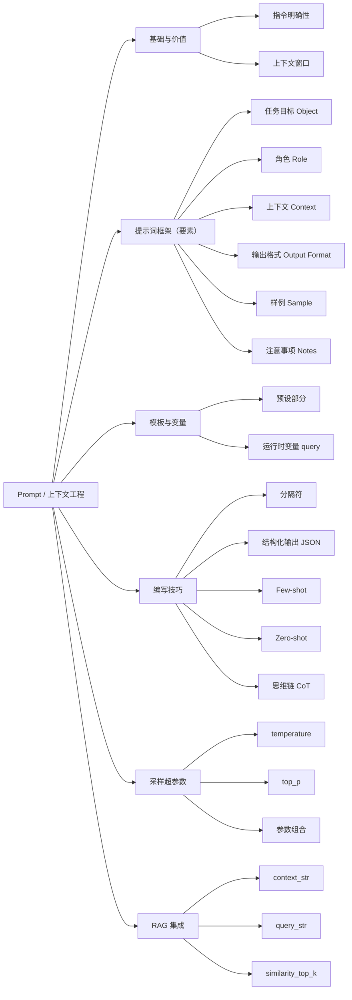

# Prompt 知识点总结

> 归纳来源：`Prompt 错题复习 2026-10-03`（共 20 题）
> 整理日期：2026-10-03
> 说明：正文带「补充」标记的内容为错题之外的扩展知识，用于建立完整认知；文末附参考文献。

---

## 目录

- [0. 知识地图](#0-知识地图)
- [1. 提示词工程基础](#1-提示词工程基础)
- [2. 提示词框架：六要素](#2-提示词框架六要素)
  - [2.1 任务目标 Object](#21-任务目标-object)
  - [2.2 角色 Role](#22-角色-role)
  - [2.3 上下文 Context](#23-上下文-context)
  - [2.4 输出格式 Output Format](#24-输出格式-output-format)
  - [2.5 样例 Sample](#25-样例-sample)
  - [2.6 注意事项 Notes / 约束](#26-注意事项-notes--约束)
- [3. 提示词模板](#3-提示词模板)
  - [3.1 预设部分 vs 运行时变量](#31-预设部分-vs-运行时变量)
  - [3.2 自定义模板的典型结构](#32-自定义模板的典型结构)
- [4. 提示词编写技巧](#4-提示词编写技巧)
  - [4.1 指令要明确：翻译案例](#41-指令要明确翻译案例)
  - [4.2 补充说明与约束边界：润色案例](#42-补充说明与约束边界润色案例)
  - [4.3 分隔符](#43-分隔符)
  - [4.4 结构化输出](#44-结构化输出)
  - [4.5 少样本提示 Few-shot](#45-少样本提示-few-shot)
  - [4.6 零样本提示 Zero-shot](#46-零样本提示-zero-shot)
  - [4.7 思维链 CoT](#47-思维链-cot)
- [5. 采样与生成超参数](#5-采样与生成超参数)
  - [5.1 temperature 温度](#51-temperature-温度)
  - [5.2 top_p 核采样](#52-top_p-核采样)
  - [5.3 temperature vs top_p（对比表）](#53-temperature-vs-top_p对比表)
  - [5.4 参数组合与场景建议](#54-参数组合与场景建议)
  - [5.5 超参数调优与 answer correctness](#55-超参数调优与-answer-correctness)
- [6. RAG 集成中的提示词](#6-rag-集成中的提示词)
  - [6.1 context_str：检索到的上下文](#61-context_str检索到的上下文)
  - [6.2 query_str：用户问题](#62-query_str用户问题)
  - [6.3 similarity_top_k：召回切片数](#63-similarity_top_k召回切片数)
- [7. 高频易混点速查](#7-高频易混点速查)
- [8. 参考文献](#8-参考文献)
- [9. 关联](#9-关联)
- [附：基于错题的复习清单](#附基于错题的复习清单)

---

## 0. 知识地图

把全部知识点挂到一张「提示词构成 → 模型推理 → 输出」的主链路上：



一条完整提示词的流水线：

```
角色设定 + 任务目标 + 上下文/参考资料 + 注意事项（约束） + 输出格式/样例 + 用户问题变量
                                  ↓
             模型推理（temperature / top_p 控制采样随机性）
                                  ↓
                 模型输出（自然语言 / 结构化 JSON）
```

| 模块 | 核心问题 | 对应章节 |
|---|---|---|
| 提示词框架 | 一句话提示词由哪些要素组成 | 2 |
| 模板 | 哪些是预设、哪些是运行时填的变量 | 3 |
| 编写技巧 | 怎么把需求说清楚（明确、分隔、示例、推理） | 4 |
| 采样超参数 | 怎么控制输出的随机性与确定性 | 5 |
| RAG 集成 | 提示词里怎么塞检索内容、召回几条 | 6 |

**若干高频考点的精确定位**：

| 考点 | 位置 |
|---|---|
| 任务目标 Object 的判定 | 2.1 |
| 明确输出格式用哪些要素 | 2.4、2.5 |
| 模板预设部分 vs 用户问题变量 | 3.1 |
| 指令明确性（翻译案例） | 4.1 |
| 润色可补充的说明与任务边界 | 4.2 |
| 分隔符的选择 | 4.3 |
| 结构化提取（JSON 示例 + 明确格式） | 4.4 |
| Few-shot 适用 / 不适用 | 4.5 |
| Zero-shot 主要归功于预训练 | 4.6 |
| CoT 最适合的领域 | 4.7 |
| temperature 越高越随机 | 5.1 |
| top_p 按累积概率筛选候选 | 5.2、5.3 |
| 调超参提升 answer correctness | 5.5 |
| `context_str` / `query_str` / `similarity_top_k` | 6.1 ~ 6.3 |

---

## 1. 提示词工程基础

- **提示词（Prompt）**：交给大模型的输入指令，用于引导模型生成期望的输出。它决定模型「做什么、怎么做、做成什么样」。
- **提示词工程（Prompt Engineering）**：设计、组织、优化提示词，使模型稳定产出高质量结果的方法与技巧集合。
- **核心目标**：把人的意图无损地转成模型能准确执行的自然语言指令，减少歧义与幻觉。
- **补充**：**上下文工程（Context Engineering）** 是更大的范畴，除提示词本身外，还包括检索到的资料、对话历史、工具定义、记忆等一切进入上下文窗口的信息。Prompt 只是上下文的一部分。

**关联**：[[RAG 知识点总结]]（RAG 的本质之一就是「自动生成更丰富的上下文」）

---

## 2. 提示词框架：六要素

一道好提示词通常由六类信息组成，可记为 **任务目标、角色、上下文、输出格式、样例、注意事项**。核心是**各要素各司其职，不要互相混淆**。

| 要素 | 英文 | 回答的问题 | 例子 |
|---|---|---|---|
| 任务目标 | Object | **做什么** | 翻译、分析优缺点、生成新闻稿 |
| 角色 | Role | 以什么身份 | 「假设你是一个专业厨师」 |
| 上下文 | Context | 背景/给谁/参考材料 | 「目标用户是青少年群体」 |
| 输出格式 | Output Format | **做成什么样** | 输出 JSON / HTML / 表格 |
| 样例 | Sample | 照什么样子仿写 | 给一组输入输出示例 |
| 注意事项 | Notes | 有哪些约束 | 只依据给定材料、不编造、拒绝违规 |

### 2.1 任务目标 Object

**定义：表达「要模型做什么」的动词性要求。**

| 题目 4 选项 | 判断 | 归类的要素 |
|---|---|---|
| A. 请你翻译以下英文文本 | ✅ | 任务目标 = 翻译 |
| B. 假设你是一个专业的厨师 | ❌ | 角色设定 |
| C. 目标用户是青少年群体 | ❌ | 上下文（受众） |
| D. 输出格式为 HTML | ❌ | 输出格式 |
| E. 请你分析一下这个产品的优缺点 | ✅ | 任务目标 = 分析 |
| F. 请你根据以下材料，生成一篇新闻稿 | ✅ | 任务目标 = 生成新闻稿 |

> 速记：**任务目标回答「做什么」；输出格式回答「做成什么样」**，两者极易混淆。

### 2.2 角色 Role

- 通过「你是一名资深……」「假设你是……」为模型设定身份与语气。
- 作用：锚定专业视角、用词风格与知识范围。
- **不属于**任务目标、上下文或输出要求。

### 2.3 上下文 Context

- 提供背景信息、目标受众、参考资料等。
- 例：目标用户是青少年、目标读者是小学三年级学生、给出的原文材料。
- 上下文**可以间接影响**输出风格，但它本身**不直接规定**输出格式。

### 2.4 输出格式 Output Format

- 直接规定输出的**形式与结构**：JSON、HTML、Markdown、表格、纯文本等。
- 常与「样例」配合，让结构更稳定。
- **不负责**说明「做什么」（那是任务目标）。

### 2.5 样例 Sample

- 通过给出「输入 → 输出」示例，让模型模仿**格式、字段、结构、语气**。
- 即 Few-shot 的具体载体，是明确输出格式的重要手段之一。

> 题目 16：可用于明确输出格式的要素 = **A. 输出格式 + B. 样例**；任务目标、上下文都不直接规定格式。

### 2.6 注意事项 Notes / 约束

「注意事项」用于约束模型行为，覆盖三类：

| 类型 | 题目 19 选项 | 说明 |
|---|---|---|
| 知识来源约束 | A. 根据上下文信息而非先验知识来回答问题 | 防止脱离给定材料、凭记忆编造 |
| 安全合规约束 | B. 提醒用户问题触及安全红线，无法提供 | 约束「什么时候不能答、不能答时怎么说」 |
| 输出范围约束 | C. 只回答用户的问题，不输出其他信息 | 避免添加无关内容 |

> 关键认识：注意事项**不仅约束「怎么答」，也约束「不能答时怎么拒绝」**，因此安全拒答也算注意事项。

**输出要求（题目 18）= 任务约束的具体化**，例如：

- A. 输出 JSON 格式 → 格式约束；
- B. `label` 只能取 0 或 1 → 字段取值范围约束；
- C. `reason` 是错误的原因 → 字段语义约束；
- D. `correct` 是修正后的文档内容 → 字段语义约束。

**任务要求（题目 20）**：

| 选项 | 判断 | 说明 |
|---|---|---|
| A. 审查文档中有没有错别字 | ✅ | 任务目标 |
| B. 如果出现错别字，指出错误并给出解释 | ✅ | 执行方式 + 输出内容 |
| C.「的」和「地」混淆不算错别字 | ✅ | 判定标准的规则约束 |
| D. 增加模型的训练数据 | ❌ | 训练阶段的事，与当前提示词任务无关 |

---

## 3. 提示词模板

### 3.1 预设部分 vs 运行时变量

题目 17：自定义提示词模板中**预设**的部分 = **A. 角色 + B. 注意事项 + D. 输出格式**。

| 部分 | 时机 | 说明 |
|---|---|---|
| 角色 | 预设（静态） | 「你是一名专业翻译」 |
| 注意事项 | 预设（静态） | 「不要编造信息」 |
| 输出格式 | 预设（静态） | 「请用 JSON 输出」 |
| **用户的问题** | **运行时（动态）** | 由变量 `{query}` / `{query_str}` 填入 |

> 速记：**固定的框架提前写好，用户问题运行时注入**；因此「用户的问题」不是模板的预设部分。

### 3.2 自定义模板的典型结构

```text
# 角色
你是一名<角色>。

# 任务目标
请<任务动词>……

# 上下文 / 参考材料
{context_str}

# 注意事项
1. 只依据上下文回答，不要编造
2. 触及安全红线时拒绝并说明
3. 只输出要求的内容

# 输出格式
请按以下 JSON 结构输出：{ ... }

# 用户问题
{query_str}
```

---

## 4. 提示词编写技巧

### 4.1 指令要明确：翻译案例

题目 2：能有效引导「英文 → 中文」翻译的 query = **A、B、C、E、F**。

| 选项 | 判断 | 原因 |
|---|---|---|
| A. English to Chinese: "Hello, world!" | ✅ | 明确源语言与目标语言 |
| B. 我想知道 "Hello, world!" 用中文怎么说 | ✅ | 清楚表达翻译意图 |
| C. 把 "Hello, world" 翻译成中文 | ✅ | 指令明确 |
| D. "Hello,world!" 中文 | ❌ | 只写「中文」，可能是翻译/解释/查义，意图不明 |
| E. 将以下内容翻译为中文："Hello, world!" | ✅ | 明确翻译动作与目标语言 |
| F. Translate the following English text to Chinese | ✅ | 英文明确源语言与目标语言 |

> 原则：**明确任务动作 + 源/目标语言（或格式）**；过于简略的 query 会把任务留给模型猜。

### 4.2 补充说明与约束边界：润色案例

题目 3：润色「小猫玩毛线球」可补充的说明 = **A、C、D、F**。

| 选项 | 判断 | 说明 |
|---|---|---|
| A. 尽量保持原文的核心意思不变 | ✅ | 润色应保持原意，避免跑偏 |
| B. 将文字翻译成英文 | ❌ | 与「润色中文」任务冲突 |
| C. 希望润色后的文字更加生动活泼有趣 | ✅ | 具体化「优美」的风格方向 |
| D. 请使用比喻和拟人的修辞手法 | ✅ | 实现「生动」的可选修辞要求 |
| E. 把这段文字扩展成 500 字小故事 | ❌ | 属于**扩写/改写**，改变任务范围 |
| F. 目标读者是小学三年级的学生 | ✅ | 帮助控制用词难度、语气与节奏 |

> 判据：补充说明应**服务于原任务**（风格、修辞、受众），而**不改变任务边界**（翻译、扩写都属于换任务）。
> 若考试严格理解为「原 query 已直接要求、不新增约束」，则核心为 **A、C**；D、F 是合理可选增强。

### 4.3 分隔符

**作用**：把「指令」「参考内容」「用户输入」等在提示词中清晰分开，避免模型混淆不同角色/来源的文本。

题目 10：如果正文里已大量使用某种符号（如 ◇）……

- **A 对**：避免用该符号作分隔符，防止混淆；应换用正文里**不常出现**的分隔符。
- B、C 错：与训练数据、推理时间无关。

题目 11：哪种符号可作分隔符？**答案：C. 以上都可以。**

- 数字 `1` ✅、尖括号 `<>` ✅ 都可以；
- 关键不是符号本身，而是**清晰、唯一、不与正文冲突**；
- 常用约定：`###`、`---`、`<context>`、`<document>`、XML 风格标签。

> 补充：Anthropic 推荐用 XML 标签（如 `<document><content>...</content></document>`）包裹资料；OpenAI 也常用 `###` 分段。原则都是**让边界无歧义**。

### 4.4 结构化输出

题目 5：从客户邮件提取结构化数据（姓名、订单号、问题类型）应选 **A、B**。

| 选项 | 判断 | 说明 |
|---|---|---|
| A. 提供你期望的 JSON 结构示例 | ✅ | 明确字段名、含义、嵌套结构，稳定输出 |
| B. 在任务目标中明确「输出 JSON 格式」 | ✅ | 直接约束输出格式，便于程序解析 |
| C. 调低 Temperature | ❌ | 能降随机性，但不是「结构化提取」的核心手段 |
| D. 先总结邮件再提取字段 | ❌ | 可能引入信息丢失/额外错误，不如直接约束格式提取 |

> 核心公式：**结构化提取 = 明确输出格式 + 给出结构示例（+ 低温度辅助）**。
> 补充：工程上还可使用 JSON mode、Function Calling / Tool Calling、Response Schema（如 Pydantic），让格式约束由接口层保证。

### 4.5 少样本提示 Few-shot

**定义**：在提示词中给出**若干「输入 → 输出」示例**，让模型模仿完成新任务。

题目 13：**不是**少样本提示应用场景的是 **B. 需要深度专业知识的任务**。

| 选项 | 判断 | 说明 |
|---|---|---|
| A. 数据稀缺或需快速适应新任务 | ✅ 适用 | 少量示例即可快速适配 |
| B. 需要深度专业知识的任务 | ❌ 不适用 | 几个示例无法凭空获得模型原本不具备的深度专业知识，需 RAG / 微调 / 专家库 |
| C. 需要快速原型设计 | ✅ 适用 | 少量示例即可搭原型 |
| D. 需要创造性写作 | ✅ 适用 | 用示例引导文风、句式、修辞 |

> 补充：Few-shot 由 GPT-3（Brown et al., 2020）系统性证明；示例数量、顺序、质量都会影响效果。

### 4.6 零样本提示 Zero-shot

**定义**：不提供任何示例，仅靠指令让模型完成新任务。

题目 14：零样本提示能完成没见过的新任务，主要归功于 **A. 预训练**。

| 选项 | 判断 | 说明 |
|---|---|---|
| A. 预训练 | ✅ | 大规模预训练带来通用语言能力、世界知识与泛化能力 |
| B. 微调 | ❌ | 微调通常需要特定任务数据 |
| C. 监督学习 | ❌ | 需要标注数据训练 |
| D. 强化学习 | ❌ | 多用于对齐、偏好优化，不是零样本泛化的主因 |

> 补充：指令微调（Instruction Tuning）与 RLHF 提升了**指令遵循与对齐**，但**零样本泛化的根基仍是预训练**。

### 4.7 思维链 CoT

**定义**：引导模型在给出答案前**显式写出中间推理步骤**，提升多步推理任务的准确率。

题目 15：CoT 应用**不是最直接**的领域是 **D. 情感分析**。

| 选项 | 判断 | 说明 |
|---|---|---|
| A. 编程问题解决 | ✅ 直接 | 需分析需求、设计步骤、调试逻辑 |
| B. 逻辑推理与论证 | ✅ 直接 | 需逐步推导 |
| C. 复杂决策支持 | ✅ 直接 | 需权衡条件、分步分析 |
| D. 情感分析 | ❌ 不最直接 | 通常是相对直接的分类任务，无需复杂多步推理 |

> 补充：CoT 变体包括 Zero-shot CoT（「Let's think step by step」）、Self-Consistency（多次采样取多数）、Tree of Thoughts 等；**CoT 提升推理，但不提供事实知识**（事实错误仍要靠 RAG）。

---

## 5. 采样与生成超参数

大模型每一步从候选 Token 中采样。原始分数（logits）→ 经超参数调节 → 归一化为概率 → 采样。**`temperature` 和 `top_p` 都作用于这一步，但作用方式不同。**

### 5.1 temperature 温度

**作用：调整整个概率分布的形状。**

- 温度**越高**：分布越**平缓**，高概率与低概率 Token 的差距**变小**，随机性更高。
- 温度**越低**：分布越**尖锐**，输出越确定。
- `T → 0`：近似**贪心解码**（总选最高概率 Token）。

题目 1：正确说法 **C（温度越高，候选 Token 的概率值越接近，随机性更高）**。

| 选项 | 判断 |
|---|---|
| A. 温度越高越适合技术报告、代码 | ❌ 反了，高确定性任务应**低温度** |
| B. 温度越高，概率差距变大 | ❌ 差距应变**小** |
| C. 温度越高，概率值越接近、更随机 | ✅ |
| D. 温度越高，低概率 Token 会超过高概率 Token | ❌ 低概率会被抬高，但通常不会超过高概率 |

> 常见温度：事实问答/代码 0 ~ 0.3；一般对话 0.7；创意写作 0.8 ~ 1.0。

### 5.2 top_p 核采样

**作用：从概率分布中筛选候选 Token 集合（截断），再在集合内采样。**

题目 6：top_p 的作用 = **B. 筛选出累积概率达到阈值的候选 Token**。

| 选项 | 判断 | 说明 |
|---|---|---|
| A. 调整候选 Token 的概率分布 | ❌ | 调整分布形状是 temperature 的活 |
| B. 按累积概率筛选候选 Token | ✅ | 按概率从高到低累加，达阈值即保留 |
| C. 直接增加候选数量 | ❌ | 越低候选越少 |
| D. 直接减少候选数量 | ❌ | 是按累积概率**动态**筛选，不是机械增减 |

题目 9：top_p=0.5 的输出特点 = **B. 相对单一**。

- 只保留累积概率达到 50% 的高概率 Token，候选池小 → 更稳定、更集中、更确定；
- 不是「非常多样化」，也不是「完全随机/无法预测」。

### 5.3 temperature vs top_p（对比表）

| 对比项 | temperature | top_p |
|---|---|---|
| 作用方式 | 调整概率分布**形状** | **截断**候选 Token 集合 |
| 低值效果 | 输出更确定 | 候选池更小，输出更确定 |
| 高值效果 | 输出更随机 | 候选池更大，输出更随机 |
| 极端情况 | T→0 近似贪心 | p→0 只留极少数 Token |
| 常用值 | 0（确定）~ 1.0（创意） | 0.9 ~ 1.0（多样） |

**计算顺序**：`logits → temperature 缩放 → softmax → top_p 截断 → 采样`。

> 联系：两者都是采样策略，共同影响随机性与多样性，通常配合使用，一般不把两个都调到极端。

### 5.4 参数组合与场景建议

| 场景 | temperature | top_p | 效果 |
|---|---|---|---|
| 高确定性（代码、翻译、结构化提取、事实问答） | 低（0 ~ 0.3） | 低（如 0.1 ~ 0.5） | 稳定、可复现 |
| 一般对话 | 0.7 | 0.9 ~ 0.95 | 自然且可控 |
| 创意多样（写作、头脑风暴） | 0.7 ~ 1.0 | 0.9 ~ 0.95 | 多样、随机 |

- 想要明显多样性与随机性：**top_p = 0.9 ~ 1.0**，常取 **0.95**，并配合较高 temperature。
- `temperature=0` 时，top_p 再高也几乎不随机。
- 只调高 top_p 而 temperature 很低，随机性也不会明显增加。

### 5.5 超参数调优与 answer correctness

题目 12：优化 answer correctness 时调整生成超参数（如 temperature）的好处 = **A. 提升生成答案的准确度**。

| 选项 | 判断 | 说明 |
|---|---|---|
| A. 提升生成答案的准确度 | ✅ | 调低温度等降低随机性，答案更稳定、更确定 |
| B. 增加模型的训练数据 | ❌ | 生成超参数不改变训练数据 |
| C. 减少模型的推理时间 | ❌ | 不直接减少推理时间 |
| D. 增加模型的参数数量 | ❌ | 不改变模型参数量 |

> 注意边界：调超参数优化的是**生成随机性/稳定性**，属于「生成后可控性」层面；它**不改变模型知识**（那是 RAG/微调的事）。

---

## 6. RAG 集成中的提示词

RAG 把检索结果注入提示词模板，因此会出现几个固定变量。

### 6.1 context_str：检索到的上下文

题目 7：LlamaIndex 默认提示词模板中 `context_str` 表示 **A. 从向量库中检索到的上下文信息**。

- 即从向量库、索引或检索器中**召回的文档片段**；
- 通常作为「参考资料」填入提示词，约束模型据此回答。

### 6.2 query_str：用户问题

- `query_str` 表示**用户的问题**，是运行时注入的动态变量。
- 易错：把 `query_str` 和 `context_str` 搞反。

### 6.3 similarity_top_k：召回切片数

题目 8：`similarity_top_k=5` 的主要作用 = **A. 一次检索出 5 个文档切片**。

| 选项 | 判断 | 说明 |
|---|---|---|
| A. 一次检索出 5 个文档切片 | ✅ | 返回相似度最高的前 5 个切片 |
| B. 增加模型训练数据 | ❌ | 无关 |
| C. 减少推理时间 | ❌ | 上下文变长反而可能增加处理量 |
| D. 增加模型参数数量 | ❌ | 无关 |

> 在 LlamaIndex 中该参数于**创建查询引擎**时设置：`index.as_query_engine(similarity_top_k=5)`（详见 [[RAG 知识点总结]] 2.6）。

---

## 7. 高频易混点速查

| 易混对 | 一句话区分 |
|---|---|
| 任务目标 Object vs 输出格式 | Object 回答「做什么」，Output Format 回答「做成什么样」 |
| Object vs Role vs Context | 做事 / 身份 / 背景，三者各归其位 |
| 上下文 vs 输出格式 | 上下文给背景，不直接规定输出形式 |
| 输出格式 vs 样例 | 格式直接规定；样例靠示例让模型模仿 |
| 模板预设 vs 运行时变量 | 角色/注意事项/输出格式预设；用户问题运行时传入 |
| temperature vs top_p | temperature 调分布形状；top_p 截断候选集合 |
| 温度高 vs 温度低 | 高 → 平缓、随机；低 → 尖锐、确定 |
| top_p 高 vs 低 | 高 → 候选多、多样；低 → 候选少、确定 |
| Few-shot vs Zero-shot | 前者给示例，后者不给示例 |
| Zero-shot 能力来源 | 主要靠预训练；微调/RLHF 只是对齐增强 |
| Few-shot 适用 vs 深度专业知识 | 示例学不来深度专业知识，那要靠 RAG/微调/专家库 |
| CoT vs 情感分析 | CoT 适合多步推理；情感分析是直接分类，不需要 |
| CoT vs 事实正确 | CoT 提升推理，不提供事实；事实错误靠 RAG |
| `context_str` vs `query_str` | 前者是检索到的上下文，后者是用户问题 |
| `similarity_top_k` vs 模型参数 | top_k 控制召回切片数，与训练数据/参数量无关 |
| 分隔符选择 vs 符号本身 | 任何符号都行，关键是别和正文大量出现的符号冲突 |
| 结构化输出 vs 调温度 | 核心是「明确格式＋给示例」；降温度只是辅助 |
| 调超参 vs 增知识 | 超参只管随机性/稳定性，不改模型知识 |

---

## 8. 参考文献

**经典论文**

1. Brown et al. *Language Models are Few-Shot Learners*（GPT-3）. NeurIPS 2020. arXiv:2005.14165
2. Liu et al. *Pre-train, Prompt, and Predict: A Systematic Survey of Prompting Methods in NLP*. ACM Computing Surveys, 2023. arXiv:2107.13586
3. Wei et al. *Chain-of-Thought Prompting Elicits Reasoning in Large Language Models*. NeurIPS 2022. arXiv:2201.11903
4. Kojima et al. *Large Language Models are Zero-Shot Reasoners*. NeurIPS 2022. arXiv:2205.11916
5. Wang et al. *Self-Consistency Improves Chain of Thought Reasoning in Language Models*. ICLR 2023. arXiv:2203.11171
6. Holtzman et al. *The Curious Case of Neural Text Degeneration*（top_p / nucleus sampling）. ICLR 2020. arXiv:1904.09751
7. Wei et al. *Emergent Abilities of Large Language Models*. TMLR 2022. arXiv:2206.07682
8. Sahoo et al. *A Systematic Survey of Prompt Engineering in Large Language Models*. arXiv:2402.07927
9. Yao et al. *Tree of Thoughts: Deliberate Problem Solving with Large Language Models*. NeurIPS 2023. arXiv:2305.10601
10. Ouyang et al. *Training Language Models to Follow Instructions with Human Feedback*（InstructGPT / RLHF）. NeurIPS 2022. arXiv:2203.02155

**官方文档**

11. OpenAI Prompt Engineering Guide：https://platform.openai.com/docs/guides/prompt-engineering
12. OpenAI 采样参数（temperature / top_p）：https://platform.openai.com/docs/api-reference/chat
13. Anthropic Prompt Engineering（XML 标签分隔）：https://docs.anthropic.com/en/docs/build-with-claude/prompt-engineering/overview
14. 阿里云百炼通义千问 API 参数：https://help.aliyun.com/zh/model-studio/developer-reference/use-qwen-by-calling-api
15. LlamaIndex 官方文档（Prompt 模板 / `similarity_top_k`）：https://docs.llamaindex.ai
16. OpenAI Structured Outputs：https://platform.openai.com/docs/guides/structured-outputs

---

## 9. 关联

### 来源（错题复习）

- [[Prompt 错题复习 2026-10-03]]

### 相关笔记

- [[RAG 知识点总结]]
- [[RAG入门]]

---

## 附：基于错题的复习清单

- [ ] 提示词六要素：任务目标、角色、上下文、输出格式、样例、注意事项。
- [ ] Object 回答「做什么」；输出格式回答「做成什么样」，别混。
- [ ] 明确输出格式靠「输出格式 + 样例」；任务目标/上下文不算。
- [ ] 模板预设：角色、注意事项、输出格式；用户问题运行时传入。
- [ ] 注意事项三约束：知识来源、安全拒答、输出范围。
- [ ] 指令要明确：明确任务动作 + 源/目标语言，别只写「中文」。
- [ ] 补充说明服务于原任务，不改变任务边界（翻译/扩写不行）。
- [ ] 分隔符任何符号都可用，但避开正文大量出现的符号。
- [ ] 结构化提取 = 明确 JSON 格式 + 给 JSON 结构示例（+ 低温度辅助）。
- [ ] Few-shot 适用：数据少、快速适应、原型、创造性写作；不适用：深度专业知识。
- [ ] Zero-shot 主要靠预训练；微调/监督学习/RL 不是主因。
- [ ] CoT 最适合多步推理（编程、逻辑、复杂决策）；情感分析不最直接。
- [ ] temperature 调分布形状：越高越随机、概率越接近；越低越确定。
- [ ] top_p 按累积概率筛候选 Token；越低越确定，越高越多样。
- [ ] top_p=0.5 → 输出相对单一；明显多样性用 top_p≈0.9~0.95。
- [ ] `temperature=0` 时 top_p 再高也几乎不随机。
- [ ] 调生成超参数提升 answer correctness：靠降随机性；不改训练数据/推理时间/参数量。
- [ ] RAG 模板：`context_str` = 检索到的上下文，`query_str` = 用户问题。
- [ ] `similarity_top_k=5` = 召回相似度最高的 5 个文档切片。
