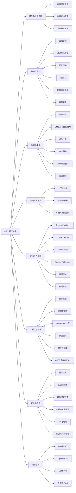

## 0. 重点回顾

今日讨论的核心结论：

1. **RAG 不是“向量检索 + LLM”这么简单**，而是一条完整的离线索引管道 + 在线查询管道。
    
2. **80% 的 RAG 失败发生在数据摄取与切片层**，不是模型层。
    
3. **纯向量检索不够**，生产环境通常需要混合检索 + 重排序。
    
4. **评估体系是 RAG 调优的前提**，没有评估就没有可靠优化。
    
5. **安全不是附加项**，而是架构级问题，尤其是多租户权限隔离、间接提示注入、知识库投毒。
    
6. **工程化与部署决定 RAG 能否从 Demo 走向生产**，涉及技术栈选型、延迟、成本、CI/CD、可观测性。
    
7. **进阶架构如 GraphRAG、Agentic RAG 有明确适用边界**，不应盲目上马。
    

---

## 1. RAG 知识地图

### 1.1 Mermaid 知识地图

### 1.2 文本版知识地图

- **基础与生命周期**
    
    - 离线索引管道
        
    - 在线查询管道
        
    - 失败模式
        
- **数据与索引**
    
    - 文档解析 → 清洗与元数据 → 切片 → 向量化 → 索引 → 增量更新
        
- **检索与重排**
    
    - 向量检索、BM25、混合检索、RRF、Rerank、查询改写（详见 [[RAG 检索知识]]）
        
- **生成与上下文**
    
    - 上下文组装、Prompt 模板、引用与幻觉控制
        
- **评估与可观测**
    
    - Context Precision、Context Recall、Faithfulness、Answer Relevancy、离线/在线评估
        
- **工程化与部署**
    
    - 编排框架、向量数据库、Embedding、K8s/本地/边缘、性能成本、CI/CD
        
- **安全与合规**
    
    - 提示注入、知识库投毒、数据提取、多租户、PII、审计
        
- **进阶架构**
    
    - GraphRAG、Agentic RAG、LightRAG、多模态 RAG
        

---

## 2. RAG 核心生命周期

### 2.1 离线索引管道

|阶段|关键任务|工程要点|
|---|---|---|
|文档摄取与解析|PDF、HTML、Markdown、扫描件解析|布局感知解析，表格、页眉页脚、多栏处理|
|数据清洗与元数据增强|去噪、提取标题/章节/类型/权限|元数据用于过滤检索和权限控制|
|切片|固定长度、递归、语义、结构、父子分块|切片策略与查询类型强相关|
|向量化|Embedding 模型编码|小模型做 Embedding + 大模型生成，成本更优|
|索引构建|Flat、IVF、HNSW、PQ|HNSW 是生产默认选择|
|增量索引|检测变更、只重嵌 delta、删除过期分块|索引会“腐烂”，增量更新是必需项|

### 2.2 在线查询管道

text

用户查询
  → 查询处理 / 改写
  → 混合检索
  → 重排序
  → 上下文组装
  → LLM 生成
  → 后处理与引用

每个箭头都是一个潜在失败点。端到端延迟通常需要控制在 **2–5 秒**。

---

## 3. 关键技术决策

### 3.1 切片策略

|策略|核心思想|适用场景|
|---|---|---|
|固定长度分块|按 Token 数切分|结构均匀文本|
|递归分块|按段落→句子→词逐级降级|通用文档|
|语义分块|相邻句子 embedding 相似度骤降处切分|技术文档、叙事文本|
|结构分块|按标题、章节切分|Markdown、HTML、法律文书|
|父子分块|子块检索，父块生成|兼顾检索精度与上下文完整性|

**关键结论**：事实型查询适合 64–128 tokens 小块；复杂推理适合 512–1024 tokens 大块。父子分块常比单纯增大切片更优雅。

### 3.2 向量索引算法

|算法|特点|适用规模|
|---|---|---|
|Flat|精度 100%，O(n)|小规模 <10 万|
|IVF|聚类后检索，速度快|百万级|
|HNSW|速度快、精度高、内存大|生产主流|
|PQ|极致压缩，精度损失|内存受限场景|

生产常见组合：**HNSW + 元数据过滤**。

### 3.3 检索与重排序

> 本主题的详细展开见配套笔记：[[RAG 检索知识]]（多路召回 + 融合 + 重排 + 查询改写 + 评估）。

- 嵌入模型是双塔架构，速度快但精度有限。
    
- Cross-Encoder 将 query 和 document 拼接编码，精度更高，但只能对少量候选精排。
    
- 典型流程：**双塔召回 Top-50 → Cross-Encoder 精排 Top-5 → LLM 生成**。
    
- RRF 用于融合多路召回结果。
    
- 纯向量检索对专有名词、ID、日期召回差，**混合检索是生产基本要求**。
    

### 3.4 技术栈选型

|维度|建议|
|---|---|
|编排框架|纯 RAG 用 LlamaIndex；复杂 Agent 用 LangChain/LangGraph|
|向量数据库|从 pgvector 起步；大规模用 Milvus；低延迟云端用 Qdrant|
|Embedding|中文用 BGE 系列；英文多语言用 GTE；不要无脑上 SOTA|
|成本策略|小模型 Embedding + 大模型生成；本地量化 + 云端分层路由|

---

## 4. 工程化与部署

### 4.1 部署模式

|模式|适用场景|关键点|
|---|---|---|
|Kubernetes 云原生|企业生产环境|GKE/EKS + 托管数据库 + 动态扩展|
|完全本地化|数据安全要求极高|单台 GPU 工作站 + 开源模型|
|边缘部署|移动设备、IoT|轻量文档选择器、SLM/云端协同|

**重要教训**：项目高风险环节常一次通过，而“把客户文档加载进知识库”这种常规环节反而最容易失败。根因通常是：默认 Embedding 不适用、缺少视觉模型、分块配置不当。

### 4.2 性能与成本优化

- 混合检索 + 重排序
    
- 语义缓存
    
- 动态批处理
    
- 模型量化：FP32 → INT8，速度提升约 3 倍，显存降低约 75%
    
- 分层模型路由：简单问答走本地量化模型，复杂推理走云端
    
- 按查询复杂度动态调整检索深度
    

### 4.3 CI/CD 与 LLMOps

- 自动化评估循环：每次代码变更运行黄金数据集
    
- 性能追踪：跟踪 RAGAS 指标变化
    
- 部署策略：云平台快速验证 → 轻量自建 → 私有化迁移
    
- 统一 OpenAI 兼容路由层，解耦模型供应商
    

---

## 5. 评估与可观测性

### 5.1 离线评估与在线监控

|层级|目标|方法|
|---|---|---|
|离线实验室|优化与回归测试|黄金数据集 + RAGAS 指标|
|在线生产车间|安全与异常检测|小型评估模型实时评分|

### 5.2 核心指标

|指标|含义|评估对象|
|---|---|---|
|Context Precision|相关文档是否排在前列|检索排序质量|
|Context Recall|相关文档是否都被召回|检索覆盖率|
|Faithfulness|答案是否完全基于上下文|幻觉检测|
|Answer Relevancy|答案是否切题|端到端质量|

### 5.3 可观测性指标

- 查询总数 / QPS
    
- 搜索与生成耗时分布
    
- RAGAS 质量评分
    
- LLM Token 消耗
    
- 每次搜索命中分块数
    
- 索引构建耗时
    

推荐：OpenTelemetry + Prometheus + Grafana。

---

## 6. 安全与合规

### 6.1 攻击面

|阶段|攻击类型|说明|
|---|---|---|
|数据摄取|知识库投毒|恶意文档注入，隐藏内容，触发词|
|检索|间接提示注入|恶意指令通过检索文档进入上下文|
|生成|数据提取攻击|诱导模型泄露知识库敏感信息|

OWASP 将提示注入列为 LLM 应用最严重漏洞。RAG 使攻击面扩展速度远超防御能力。

### 6.2 纵深防御

三层框架参考：

1. **用户输入侧**：规则匹配 + 语义异常检测
    
2. **上下文组装侧**：基于来源的指令层级，检索内容标记为数据而非指令
    
3. **输出侧**：策略引擎 + 语义漂移检测
    

效果参考：攻击成功率从 **71.4% 降至 11.3%**，中位延迟仅增加约 61ms。

其他方案：

- RAGDEFENDER：检索后过滤对抗内容
    
- ShieldRAG：对抗性知识对齐
    
- SMAT：双模型架构防御数据提取
    

### 6.3 多租户权限隔离

核心矛盾：**检索按相关性排序，而非按授权排序**。

推荐三层架构：

1. **策略感知摄取**：文档入库标注租户、敏感级别、ACL
    
2. **检索时门控**：权限过滤嵌入检索查询内部，而非检索后过滤
    
3. **共享推理**：多租户共享推理基础设施，安全操作集中在服务端
    

### 6.4 数据隐私与合规

- PII 脱敏必须在推理前完成
    
- 脱敏应内联在请求关键路径中
    
- 本地化部署 + 完整审计日志是政务、金融、医疗合规基础
    
- 参考：GDPR、EU AI Act、中国信通院 RAG 安全规范、OWASP LLM Top 10、ZTDS
    

### 6.5 安全评估与持续监控

- 对抗性测试集：注入成功率、策略违规率、机密泄露评分、事实准确性
    
- 红队回归测试纳入 CI/CD
    
- 持续审计循环，支持分类器再训练
    

---

## 7. 进阶架构

|架构|优势|代价|适用场景|
|---|---|---|---|
|GraphRAG|多跳推理、全局总结|资源消耗高 10–20 倍|关系网络、全局趋势|
|Agentic RAG|自主决定检索时机与步骤|复杂度高|多步推理、工具调用|
|LightRAG|图结构 + 向量互补|中等|知识图谱增强|
|多模态 RAG|图文混合检索|工程复杂度高|文档含图表、扫描件|

决策原则：事实型问答用向量 RAG 足够；关系分析与全局总结才值得上 GraphRAG。

---

## 8. 从原型到生产的路线图

|阶段|目标|核心任务|关键产出|
|---|---|---|---|
|阶段一：原型验证|跑通基本链路|解析 → 切片 → 向量化 → 检索 → 生成|可回答简单问题的 Demo|
|阶段二：检索质量优化|提升召回与精确率|混合检索 + RRF + Rerank|Recall@5 达到 80%+|
|阶段三：评估体系建设|量化系统表现|黄金数据集 + RAGAS 四指标|每次变更可量化对比|
|阶段四：安全与多租户|企业级加固|RBAC + ACL + PII 脱敏 + 审计|通过安全评审|
|阶段五：部署与可观测|生产上线|K8s + 监控 + 告警 + CI/CD|可监控、可回滚、可扩展|
|阶段六：持续优化|降本增效|增量索引 + 语义缓存 + 量化 + 分层路由|成本可控、延迟达标|

---

## 9. 推荐学习资源

### 综述与论文

- Gao et al., _Retrieval-Augmented Generation for Large Language Models: A Survey_, arXiv:2312.10997
    
- _From vectors to knowledge graphs: A comprehensive analysis of modern RAG architectures_, Computer Science Review, 2026
    
- _Agentic Retrieval-Augmented Generation: A Survey on Agentic RAG_, arXiv:2501.09136
    

### 框架与工具

- LangChain / LlamaIndex / LangGraph
    
- RAGAS 评估框架
    
- Qdrant / Milvus / pgvector / Weaviate
    
- LightRAG / nvidia-rag / DD_Rag
    

### 安全与合规

- OWASP LLM Top 10
    
- 中国信通院《检索增强生成系统安全技术规范》
    
- GDPR、EU AI Act
    
- IETF ZTDS 零信任数据净化协议
    

### 实践项目建议

1. **基础 RAG 管道**：LangChain + 向量检索 + BM25 + RRF
    
2. **评估驱动优化**：RAGAS 四指标 + 切片/Rerank/Top-K 对比
    
3. **进阶架构探索**：LightRAG 或 Agentic RAG + LangGraph
    

---

## 10. 自检清单

学完一个阶段后，尝试回答：

- □ 
    
    能否解释离线索引管道与在线查询管道的完整数据流？
    
- □ 
    
    能否说明为什么纯向量检索不够，混合检索解决什么问题？
    
- □ 
    
    能否区分 Context Precision 与 Context Recall？
    
- □ 
    
    能否解释 Cross-Encoder 重排序为什么比双塔更准？
    
- □ 
    
    能否设计一个多租户 RAG 的权限隔离方案？
    
- □ 
    
    能否说明间接提示注入与用户输入提示注入的区别？
    
- □ 
    
    能否列出至少三种知识库投毒防御方法？
    
- □ 
    
    能否说明 GraphRAG 的适用边界与代价？
    
- □ 
    
    能否为 RAG 系统设计离线评估与在线监控双层体系？
    
- □ 
    
    能否说明增量索引为什么是生产必需项？
    

---

> 按图索骥建议：先沿“基础与生命周期 → 数据与索引 → 检索与重排 → 评估”走通一遍，再进入“工程化与部署 → 安全与合规 → 进阶架构”。每学一个节点，都用一个最小项目验证，避免只停留在概念层。

本回答由 AI 生成，内容仅供参考，请仔细甄别