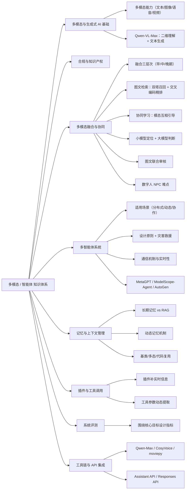

# 多模态 知识点总结

> 归纳来源：`多模态 错题复习 2026-10-05`、`多模态 错题复习 2026-10-08`
> 整理日期：2026-10-08
> 说明：正文带「补充」标记的内容为错题之外的扩展知识，用于建立完整认知；文末附参考文献。

---

## 目录

- [0. 知识地图](#0-知识地图)
- [1. 多模态与生成式 AI 基础](#1-多模态与生成式-ai-基础)
  - [1.1 多模态能力概览](#11-多模态能力概览)
  - [1.2 Qwen-VL-Max 的能力边界](#12-qwen-vl-max-的能力边界)
  - [1.3 多模态应用场景](#13-多模态应用场景)
- [2. AI 生成内容的合规与知识产权](#2-ai-生成内容的合规与知识产权)
  - [2.1 降低知识产权风险的关键](#21-降低知识产权风险的关键)
  - [2.2 涉及的权益类型](#22-涉及的权益类型)
- [3. 多模态融合、协同学习与应用架构](#3-多模态融合协同学习与应用架构)
  - [3.1 多模态融合的三种层次](#31-多模态融合的三种层次)
  - [3.2 图文检索最佳实践](#32-图文检索最佳实践)
  - [3.3 多模态协同学习](#33-多模态协同学习)
  - [3.4 小模型 + 大模型：分而治之](#34-小模型--大模型分而治之)
  - [3.5 图文联合审核流程](#35-图文联合审核流程)
  - [3.6 数字人 NPC 的技术难点](#36-数字人-npc-的技术难点)
- [4. 多智能体（Multi-Agent）系统](#4-多智能体multi-agent系统)
  - [4.1 适用场景](#41-适用场景)
  - [4.2 设计原则（含灾害救援案例）](#42-设计原则含灾害救援案例)
  - [4.3 通信机制与实时性](#43-通信机制与实时性)
  - [4.4 多智能体框架与项目](#44-多智能体框架与项目)
- [5. 智能体记忆与上下文管理](#5-智能体记忆与上下文管理)
  - [5.1 长期记忆 vs RAG](#51-长期记忆-vs-rag)
  - [5.2 记忆选型与成本](#52-记忆选型与成本)
  - [5.3 缓解上下文压力：动态记忆机制](#53-缓解上下文压力动态记忆机制)
  - [5.4 基类 / 抽象类设计](#54-基类--抽象类设计)
- [6. 大模型插件与工具调用](#6-大模型插件与工具调用)
  - [6.1 插件是什么](#61-插件是什么)
  - [6.2 工具参数的动态提取](#62-工具参数的动态提取)
- [7. 智能体系统评测](#7-智能体系统评测)
  - [7.1 评测体系的关键考虑因素](#71-评测体系的关键考虑因素)
- [8. 多模态工具链与 API 集成](#8-多模态工具链与-api-集成)
  - [8.1 工具定位：Qwen-Max / CosyVoice / moviepy](#81-工具定位qwen-max--cosyvoice--moviepy)
  - [8.2 典型协同流程](#82-典型协同流程)
  - [8.3 Assistant API：更新智能体与交互步骤](#83-assistant-api更新智能体与交互步骤)
  - [8.4 Responses API](#84-responses-api)
- [9. 高频易混点速查](#9-高频易混点速查)
- [10. 参考文献](#10-参考文献)
- [11. 关联](#11-关联)
- [附：基于错题的复习清单](#附基于错题的复习清单)

---

## 0. 知识地图

把全部知识点挂到「多模态能力 → 融合与架构 → 多智能体 → 记忆/工具 → 工具链与 API」的主链路上：



多模态 + 智能体应用的一条典型流水线：

```
输入（文本 / 图像 / 音频 / 视频）
            ↓
预处理与粗筛（规则 / 小模型定位关键区域）
            ↓
多模态融合与理解（跨模态对齐 + 联合语义）
            ↓
多智能体协作（规划 / 工具调用 / 动态记忆）
            ↓
输出（文本 / 语音 TTS / 视频合成 / 处置策略）
```

| 模块 | 核心问题 | 对应章节 |
|---|---|---|
| 多模态基础 | 有哪些模态能力、模型边界、用在哪些场景 | 1 |
| 合规与知识产权 | 生成内容怎么降低侵权风险 | 2 |
| 融合与架构 | 跨模态怎么对齐、检索怎么做、小模型与大模型怎么分工 | 3 |
| 多智能体 | 什么时候用多 Agent、怎么设计、怎么通信 | 4 |
| 记忆与上下文 | 记住用户用长期记忆还是 RAG、上下文爆了怎么办 | 5 |
| 插件与工具 | 怎么补实时信息、工具参数怎么提取 | 6 |
| 系统评测 | 怎么衡量多智能体系统是否达标 | 7 |
| 工具链与 API | 文本/语音/视频工具怎么组合、API 怎么调 | 8 |

**若干高频考点的精确定位**：

| 考点 | 位置 |
|---|---|
| 降低 AI 生成内容知识产权风险 | 2.1 |
| Qwen-VL-Max 能力边界 | 1.2 |
| 图文检索为何用多模态融合 | 3.1、3.2 |
| 多模态协同学习 | 3.3 |
| 店巡检：小模型定位 + 大模型判断 | 3.4 |
| 图文混合违规审核 | 3.5 |
| 数字人 NPC 最难实现的技术 | 3.6 |
| 多 Agent 最适合的场景 | 4.1 |
| 灾害救援多 Agent 设计原则 | 4.2 |
| 实时性极高时效率低的通信方式 | 4.3 |
| MetaGPT vs 其他多智能体项目 | 4.4 |
| 长期记忆 vs RAG | 5.1、5.2 |
| 缓解上下文压力 | 5.3 |
| 基类设计为基类的原因 | 5.4 |
| 时间插件 / 插件定位 | 6.1 |
| 多轮对话工具参数提取 | 6.2 |
| 评测体系的关键因素 | 7.1 |
| Qwen-Max / CosyVoice / moviepy 分工 | 8.1、8.2 |
| Assistant API / Responses API | 8.3、8.4 |

---

## 1. 多模态与生成式 AI 基础

### 1.1 多模态能力概览

- **多模态（Multimodal）**：模型同时理解 / 生成多种模态的信息——文本、图像、语音、视频。
- **理解类**：图文理解（VLM，如 Qwen-VL）、语音识别（ASR）、视频理解。
- **生成类**：文本生成（LLM）、图像生成（文生图）、语音合成（TTS，如 CosyVoice）、视频生成。
- **补充**：多模态的关键价值是**联合语义理解**——「图 + 文」组合后可能产生单看任一模态都不违规的含义（见 3.5 图文审核）。

### 1.2 Qwen-VL-Max 的能力边界

题目 2：以下哪项**不属于** Qwen-VL-Max 的能力？**答案：D（实时三维场景重建）**。

| 选项 | 判断 | 说明 |
|---|---|---|
| A. 识别图像中的物体并进行描述 | ✅ 属于 | 二维图像理解 + 语言描述 |
| B. 将图像中的数据图表转化为可编辑表格 | ✅ 属于 | 图表理解 + 结构化文本输出 |
| C. 基于图像内容创作故事 | ✅ 属于 | 图文理解 + 文本生成 |
| D. 实时三维场景重建 | ❌ 不属于 | 需要三维重建 / 空间建模能力，非 VLM 输出范畴 |

> **核心认识**：Qwen-VL-Max 是**视觉语言模型（VLM）**，能力集中在**二维图像理解、推理与文本生成**，输出以文本为主，**不做实时三维重建**。
> 补充：三维重建属于专门的三维视觉/几何任务（如 NeRF、3D Gaussian Splatting、深度估计），与 VLM 的模态种类、输出形式都不同。

### 1.3 多模态应用场景

| 场景 | 用到的模态能力 |
|---|---|
| 影视 AI 视频生成 | 文生剧本、图像/动作、语音合成、视频合成 |
| 门店巡检 | 视觉理解（图像分类 / 检测 / 分割） |
| 游戏数字人 NPC | 语音识别、TTS、动作捕捉、剧情生成 |
| 社交平台内容审核 | 图文多模态理解 |
| 美食推荐智能体 | 文本对话 + 长期记忆 |
| 视频配音 / 字幕 | LLM + TTS + 视频编辑库 |
| 大型物流仓储 | 多智能体协作（筛选、搬运、路径规划） |

---

## 2. AI 生成内容的合规与知识产权

### 2.1 降低知识产权风险的关键

题目（10-05 第 1 题）：影视制作公司开发 AI 视频生成系统，哪些措施能降低知识产权风险？**答案：A**。

| 选项 | 判断 | 说明 |
|---|---|---|
| A. LLM 生成剧本初稿，供编剧团队进一步修改完善 | ✅ | 增加**人类原创性贡献**，避免直接复制或高度模仿 |
| B. 图像理解捕捉演员表情，映射到虚拟主播 | ❌ | 涉及演员肖像权、表演者权、个人信息权益，未授权易侵权 |
| C. 推荐系统为观众推荐直播内容 | ❌ | 属于内容分发，不降低生成过程的知识产权风险 |
| D. 语音合成替代人工配音演员 | ❌ | 未经授权使用他人声音/版权音频，可能侵犯声音权益、表演者权、著作权 |

> **核心结论**：降低 IP 风险靠「**增加人类原创性贡献 + 获取授权 + 避免直接复制**」，而不是堆更多 AI 自动化环节。

### 2.2 涉及的权益类型

| 权益 | 可能被什么行为侵犯 |
|---|---|
| 肖像权 | 未授权用演员面部 / 形象训练或生成虚拟形象 |
| 表演者权 | 未授权复现表演、用表演数据训练 |
| 声音权益 | 未授权克隆、合成他人声音 |
| 个人信息权益 | 未经同意处理人脸、声纹等个人生物信息 |
| 著作权 | 使用受版权保护的剧本、音频、影像 |

> **补充**：合规的常见路径——获得权利人授权 / 使用可商用素材库 / 保留人类实质性创作贡献 / 建立生成内容审核与溯源机制。

---

## 3. 多模态融合、协同学习与应用架构

### 3.1 多模态融合的三种层次

题目（10-08 第 3 题）：图文检索中，哪种技术结合图像内容与关联文本描述以提高检索准确性？**答案：C. 多模态融合**。

- A. Stable Diffusion ❌：图像生成模型；
- B. 文生图 ❌：属于生成任务；
- D. 语音识别 ❌：语音转文本，与图文检索无关。

**多模态融合的核心**：让图像、文本、语音等不同模态信息在**同一语义空间**中互相配合，提升理解、检索、生成等任务效果。

| 融合层次 | 做法 | 特点 |
|---|---|---|
| **早期融合** | 原始特征直接拼接 | 简单，效果一般 |
| **中期融合** | 各模态先编码，再用交叉注意力等交互 | 精度高，计算贵 |
| **晚期融合** | 各模态独立预测后融合分数 | 灵活，交互浅 |

> **补充**：模态间「对齐 + 融合」是跨模态任务的基础；常用对比学习（对齐语义空间）与跨模态注意力（交互）。

### 3.2 图文检索最佳实践

| 阶段 | 做法 |
|---|---|
| **召回** | 双塔模型 + 对比学习（如 CLIP），从大规模库快速取 Top-K |
| **精排** | 交叉编码器（如 BLIP、ALBEF）做细粒度图文交互 |
| **训练技巧** | 难负例挖掘、多任务学习、高质量数据、大 batch、温度系数 |

> 记忆：**召回要快（双塔），精排要准（交叉编码器）**。

### 3.3 多模态协同学习

题目（10-08 第 10 题）：多模态协同学习中，不同模态数据如何协作？**答案：B. 利用一种模态的信号作为另一模态学习的辅助或引导**。

| 选项 | 判断 | 说明 |
|---|---|---|
| A. 独立学习各自模态特征后直接合并 | ❌ | 只是晚期融合，没有真正协同交互 |
| B. 一种模态辅助 / 引导另一模态学习 | ✅ | 跨模态互补与引导 |
| C. 仅依赖单一最强模态训练 | ❌ | 放弃多模态互补优势 |
| D. 各模态相互隔离、不交互 | ❌ | 不是协同学习 |

> **核心**：**跨模态互补与引导**——图像帮助文本理解语义，文本引导图像关注关键区域。
> 常用方法：对比学习、知识蒸馏、跨模态注意力。

### 3.4 小模型 + 大模型：分而治之

题目（10-05 第 2 题）：门店巡检系统（垃圾桶是否盖好、操作台是否整洁等）大模型同时做识别与判断效果不好，哪种改进**成本较低**？**答案：C**。

| 选项 | 判断 | 说明 |
|---|---|---|
| A. 增加更多监控摄像头 | ❌ | 硬件、部署、维护成本高，且不一定解决判断不准 |
| B. 降低监控画面分辨率 | ❌ | 会丢失关键细节（盖是否盖好、污渍等） |
| C. 用物体分割小模型识别关键区域，再输入大模型判断状态 | ✅ | 小模型定位 + 大模型专注判断，成本低、效果好 |
| D. 收集高质量数据微调大模型 | ❌ | 标注、算力、时间成本高 |

> **核心思想**：**分而治之**——小模型做「定位/裁剪」，大模型做「状态判断」，降低大模型输入复杂度、减少干扰。
> **补充**：这是多模态系统的常见范式：专有模型（检测/分割/OCR）+ 通用大模型（语义判断/决策），兼顾成本与精度。

### 3.5 图文联合审核流程

题目（10-05 第 4 题）：社交平台自动屏蔽违规评论，需同时处理文字、图片，哪种方案更合理？**答案：B**。

| 选项 | 判断 | 说明 |
|---|---|---|
| A. 延迟所有 AI 生成内容等人工审核 | ❌ | 成本高、效率低、体验差 |
| B. 多模态模型拦截图文混合违规（如 `qwen-vl-7b`） | ✅ | 同时理解图像与文本，识别图文组合后的真实语义 |
| C. 独立关键词库分别过滤文本和图片 | ❌ | 关键词适合文本初筛，图片难靠关键词过滤，图文混合违规识别不了 |
| D. 要求用户上传前手动选择分类标签 | ❌ | 依赖用户自觉，恶意用户可故意选错 |

**图文联合审核的完整流程**：

```
预处理 → 规则/小模型粗筛 → 多模态模型精判 → 策略引擎分级处置 → 人工复核 → 反馈优化
```

> **关键认识**：单独看「图」或「文」可能都正常，**组合后**才产生违规含义——必须用多模态模型做**联合语义判断**。

### 3.6 数字人 NPC 的技术难点

题目（10-05 第 3 题）：游戏公司开发 AI 数字人 NPC，哪项技术要求目前**最难实现**？**答案：B**。

| 选项 | 判断 | 说明 |
|---|---|---|
| A. 根据玩家情绪调整对话语气 | ❌ 有降级方案 | 情绪分类 + 规则映射 + TTS 语气 + LLM 风格控制，已有落地 |
| B. 实时生成符合角色设定的剧情分支 | ✅ 最难 | 要求实时生成 + 符合人设 + 与世界观/任务状态一致 + 可落地执行 + 长期记忆一致 |
| C. 动作捕捉复现预设舞蹈动作 | ❌ 较成熟 | 动作捕捉与动画重定向技术成熟 |
| D. 识别语音指令执行简单任务 | ❌ 较成熟 | 语音识别 + 意图理解 + 简单任务执行已广泛应用 |

> **难点本质**：生成式 AI 在游戏中的核心瓶颈是 **长程一致性、可控性、实时性与游戏系统集成**。
> 对比：**预设分支选择**是传统方案，难度低；「实时生成**符合设定**的分支」才难。

---

## 4. 多智能体（Multi-Agent）系统

### 4.1 适用场景

题目（10-08 第 1 题）：以下哪个场景**最适合**采用多 Agent 系统？**答案：C. 大型物流仓储中心的自动化物资筛选与搬运**。

| 选项 | 判断 | 说明 |
|---|---|---|
| A. 单一目标的持续追踪任务 | ❌ | 单 Agent 或传统方法即可 |
| B. 简单的自动化仓库物品搬运 | ❌ | 任务固定，不需要多 Agent 协作 |
| C. 大型物流仓储中心自动化筛选与搬运 | ✅ | 涉及筛选、搬运、路径规划、任务分配，需多设备协同并适应环境变化 |
| D. 个人电脑的操作系统管理 | ❌ | 通常是集中式系统，不是多 Agent 典型场景 |

> **多 Agent 系统特点**：分布式、适应性、动态性。
> **适用判据**：**复杂 + 分布式 + 动态变化 + 需要多个智能体协作**；简单、固定、集中式任务不需要。

### 4.2 设计原则（含灾害救援案例）

**常见设计原则**：自治性、分布式与去中心化、协调与协作、通信效率、动态适应与重规划、鲁棒性与容错、可扩展性、异构性支持、全局与局部平衡、资源约束意识、安全与隐私、可观测与可干预。

> **关键**：没有万能原则，必须根据场景权衡。

题目（10-08 第 9 题）：大规模灾害救援多 Agent 系统，哪个设计原则对提升整体效能**最关键**？**答案：B. Agent 之间仅在必要时进行信息交换，减少通信开销**。

| 选项 | 判断 | 说明 |
|---|---|---|
| A. 所有 Agent 采用相同算法和策略 | ❌ | 无法适应不同子任务（搜索/救援/物资分配异构） |
| B. Agent 间仅在必要时交换信息，减少通信开销 | ✅ | 通信受限场景下高效协作的关键 |
| C. 设计强大的中心化控制器统一调度 | ❌ | 易成单点故障和通信瓶颈 |
| D. 强化局部优化，各 Agent 只提高自身效率 | ❌ | 容易导致全局资源分配不合理 |

> **灾害救援场景特征**：环境动态、**通信受限**、任务异构、Agent 分布广。
> 因此 **按需通信、去中心化、动态适应、容错** 的权重最高。

### 4.3 通信机制与实时性

题目（10-08 第 11 题）：通信实时性要求极高的场景中，以下哪个通讯方式效率较低？**答案：D. 中心化协调**。

| 通信方式 | 说明 | 实时性 |
|---|---|---|
| A. 直接通信 | Agent 间直接交换信息（点对点） | 最高 |
| B. 黑板模型 | 共享空间供 Agent 发布/获取信息（间接通信） | 可能慢，可优化 |
| C. 基于事件的通信 | 订阅/发布事件，异步推送 | 较高 |
| D. 中心化协调 | 中央控制器统一调度 | **最低** |

**实时性效率排序（通常）**：`直接通信 > 事件通信 > 黑板模型 > 中心化协调`。

**中心化协调为什么最慢**：

- 所有信息/请求/状态都汇总到中央，再由中央决策、调度、下发；
- 多一跳延迟 + 中央节点瓶颈 + 排队延迟 + 单点故障 + 扩展性差。

> **一句话记忆**：**黑板模型是「可能慢」，中心化协调是「必然容易堵」**。
> 易错点：不要只比较「通信模式是否间接」，还要看**系统架构是否必然造成瓶颈**。

### 4.4 多智能体框架与项目

题目（10-08 第 5 题）：哪个项目强调软件开发中多智能体协作的**组织结构扁平化**，并能直接根据用户请求生成**全面的软件开发文档套件**？**答案：C. 用 MetaGPT 构建软件开发公司**。

| 项目 | 定位 | 说明 |
|---|---|---|
| **MetaGPT** | 多智能体 + 软件开发 SOP | 模拟产品经理、架构师、项目经理、工程师等角色，把需求转成需求文档、设计文档、任务拆分、代码等完整套件 |
| **ModelScope-Agent** | 多智能体 + 工具调用 | 支持多轮对话中的工具参数动态提取（见 6.2） |
| **AutoGen** | 多智能体对话框架 | 通用多智能体对话，但不专门生成全面开发文档套件 |
| 斯坦福小镇 / 虚拟社区 | 社会模拟 | 模拟社会行为，不生成软件开发文档 |

> **记忆**：**MetaGPT = 多智能体 + 软件开发 SOP + 文档/代码生成**。

---

## 5. 智能体记忆与上下文管理

### 5.1 长期记忆 vs RAG

题目（10-05 第 6 题）核心区别：

| 维度 | 长期记忆 | RAG |
|---|---|---|
| 核心目的 | 记住用户偏好、忌口、习惯、历史事实 | 从外部知识库检索信息，增强回答 |
| 数据对象 | 用户个人数据 | 文档、知识库、规则、FAQ |
| 数据来源 | 对话中自动抽取、积累 | 人工上传或同步的外部资料 |
| 是否个性化 | 强个性化，按用户隔离 | 通常共享，不针对个人 |
| 更新方式 | 随对话持续更新、合并、修正 | 文档更新后重新切片、建索引 |
| 检索范围 | 只检索当前用户的记忆 | 检索整个知识库 |
| 典型问题 | 「这个用户以前说过什么？」 | 「资料里怎么写的？」 |
| 成本维护 | 平台托管时较低 | 自建向量库、索引、重排，成本较高 |

> **一句话**：**长期记忆记用户，RAG 查知识。** 二者可结合。
> 补充：长期记忆底层**可能**也用向量检索，但**目标不同**（个性化 vs 知识检索），不能混为一谈。

### 5.2 记忆选型与成本

题目（10-05 第 5 题）：百炼美食推荐智能体要记住用户忌口，哪种方案**成本更低**？**答案：D**。

| 选项 | 判断 | 说明 |
|---|---|---|
| A. 自建向量数据库做实时对话语义检索 | ❌ | 需构建向量库、维护索引，过重 |
| B. 自建历史对话知识库 + RAG 检索全部聊天记录 | ❌ | 存储、计算、维护成本最高 |
| C. 提示用户每次提供忌口信息 | ❌ | 没有积累记忆，体验差，不满足需求 |
| D. 使用平台长期记忆功能 | ✅ | 自动持久化用户偏好、忌口，后续对话自动调用，成本低 |

> **选型原则**：平台已提供能力时，**优先用托管的长期记忆**，而不是自建 RAG 去「记住用户」。

### 5.3 缓解上下文压力：动态记忆机制

题目（10-08 第 8 题）：工作日志、历史检索数据等占用大量上下文、影响 Agent 规划性能，哪些手段可缓解？**答案：A. 引入上下文感知的动态记忆机制，优先保留关键信息**。

| 选项 | 判断 | 说明 |
|---|---|---|
| A. 上下文感知的动态记忆机制，优先保留关键信息 | ✅ | 智能决定记住什么、忘记什么、如何找回 |
| B. 固定窗口 / 固定 tokens 截断，只留最近对话 | ❌ | 容易丢失关键历史 |
| C. 用 Transformer-XL 等注意力变种覆盖更长上下文 | ❌ | 目的是处理更长上下文，不是缓解占用，反而增加计算负担 |
| D. 每次对话都重启 Agent 状态以清空旧信息 | ❌ | 丢失多轮对话与任务连续性 |

**动态记忆机制的五类常见做法**：

1. **上下文驻留压缩**：在窗口内删减、压缩、转成潜在向量；
2. **检索增强存储**：记忆存外部数据库，需要时检索回来；
3. **反思式自我改进**：复盘成功/失败，提炼可复用经验；
4. **层次化虚拟上下文**：模仿内存层级，按需加载不同粒度信息；
5. **策略学习管理**：用强化学习训练「记忆管理器」，决定何时读写删查。

> **一句话**：不是简单截断或重启，而是**智能决定记住什么、忘记什么、如何找回**。

### 5.4 基类 / 抽象类设计

题目（10-05 第 9 题）：将 `AgentModule` 设计为基类的原因，正确的有 **A、B、C、F**。

| 选项 | 判断 | 说明 |
|---|---|---|
| A. 提供统一的 `call` 方法，用相同方式调用所有子类 | ✅ | 统一接口 |
| B. 允许子类定义自己的 `query` 方法，增加灵活性 | ✅ | 多态 / 可扩展 |
| C. 多个代理模块共享相同接口，实现代码复用 | ✅ | 代码复用 |
| D. 隐藏私有属性、保护数据 | ❌ | 属于**封装**机制，不是基类设计的主要原因 |
| E. Python 不支持多重继承，因此需要这样设计 | ❌ | **Python 支持多重继承** |
| F. 简化类中的构造函数，减少重复代码 | ✅ | 复用公共初始化逻辑 |

> **基类/抽象类的优势**：**统一接口、多态、代码复用、简化子类构造函数**。
> **易错点**：混淆「封装」（隐藏私有属性，靠 `_`/`__` 与访问控制）与「继承」（复用 + 多态）的作用。
> 补充：题目中 `AgentModule` 并非阿里云百炼公开 SDK 的标准基类，可能来自教学/第三方封装，按通用 OOP 原则理解即可。

---

## 6. 大模型插件与工具调用

### 6.1 插件是什么

题目（10-08 第 4 题）：需要模型理解并回应与当前时间相关的问题，最可能用到的插件是？**答案：C. 时间插件**。

- A. 代码审查插件 ❌：检查代码；
- B. 天气查询插件 ❌：虽涉及时间，但核心是天气；
- C. 时间插件 ✅：获取当前系统时间 / 网络时间；
- D. 翻译插件 ❌：翻译文本。

> **插件 = 大模型的外接工具箱**：模型负责理解问题，插件负责查外部数据或执行操作。
> 作用：**补足大模型不知道实时信息、不能直接操作外部系统等短板**。
> 常见插件：时间、天气、代码审查、翻译、搜索等。

### 6.2 工具参数的动态提取

题目（10-08 第 7 题）：ModelScope-Agent 中如何实现对多轮对话中工具参数的有效提取？**答案：B. 利用自然语言理解技术动态分析对话内容，识别并提取参数**。

| 选项 | 判断 | 说明 |
|---|---|---|
| A. 静态定义每种工具所需参数，不允许动态调整 | ❌ | 无法适应多轮变化 |
| B. 用 NLU 动态分析对话内容，识别并提取参数 | ✅ | 结合上下文理解、提取、补全 |
| C. 仅依赖用户明确指示参数位置 | ❌ | 无法自动提取 |
| D. 所有调用预先配置固定参数 | ❌ | 不支持多轮交互调整 |

> **核心认识**：**schema 固定，值动态**。
> - 参数名、类型、是否必填、可选参数集合 → **固定**；
> - 每次调用实际用哪些参数、参数值是什么 → **由对话动态决定**。
> 多轮对话中还要：追问缺失参数、结合上下文补全、用户改口时更新、把「明天/后天」转成具体日期。

示例：

```python
get_weather(city, date, unit=None)
```

用户说「查一下明天北京的天气」→ Agent 提取 `city=北京`、`date=明天→具体日期`。

---

## 7. 智能体系统评测

### 7.1 评测体系的关键考虑因素

题目（10-08 第 6 题）：为多智能体「软件公司」设计评测体系，衡量系统**遵循用户需求开发软件的实际能力**，以下哪项**不是**关键考虑因素？**答案：C. 交互界面美观程度**。

| 选项 | 判断 | 说明 |
|---|---|---|
| A. 用户体验主观感受量化（如情感分析评估满意度） | ✅ 可纳入 | 属用户体验与满意度 |
| B. Agent 间协作效率指标 | ✅ 关键 | 多 Agent 系统整体是否流畅 |
| C. 交互界面美观程度 | ❌ 不是关键 | 影响参与度，但不反映「按需求开发软件」的能力 |
| D. 实时性与响应速度 | ✅ 关键 | 能否快速适应用户需求变化 |

> **原则**：评测体系要**围绕核心目标**设计。此处核心目标是「按需求开发软件」，关键因素是需求理解、协作效率、产物正确性、响应速度、用户满意度；**界面美观不是衡量开发能力的关键指标**。

---

## 8. 多模态工具链与 API 集成

### 8.1 工具定位：Qwen-Max / CosyVoice / moviepy

题目（10-05 第 10 题）：关于三者协同，正确的有 **B、C、F**。（易错：误以为 moviepy 能文本转视频、Qwen-Max 主要生成字幕）

| 工具 | 核心功能 |
|---|---|
| **Qwen-Max** | 文本生成、自然语言处理（LLM） |
| **CosyVoice** | 文本转语音（TTS，语音合成） |
| **moviepy** | 视频编辑、合成、获取媒体信息（如音频时长） |

| 题目选项 | 判断 | 说明 |
|---|---|---|
| A. moviepy 可直接将文本转换为视频 | ❌ | moviepy 是视频编辑库，不能直接文本转视频 |
| B. CosyVoice 可将文本转换为音频 | ✅ | TTS |
| C. 典型流程：Qwen-Max → CosyVoice → moviepy | ✅ | 文本 → 音频 → 视频合成 |
| D. CosyVoice 主要功能是视频剪辑 | ❌ | 它是语音合成，不是剪辑 |
| E. Qwen-Max 主要用于生成视频字幕 | ❌ | 它是语言模型，用于文本生成 |
| F. moviepy 可获取音频文件持续时间用于字幕 | ✅ | `AudioFileClip` 可读时长，用于字幕时间轴 |

### 8.2 典型协同流程

```
Qwen-Max：生成 / 优化文本（脚本、分镜、字幕文案）
        ↓
CosyVoice：文本转语音（生成配音音频）
        ↓
moviepy：合成音频与画面、生成字幕、读取媒体信息（如音频时长）
```

> **易错总结**：**LLM 管文本、TTS 管声音、视频库管剪辑合成**——各司其职，不要张冠李戴。

### 8.3 Assistant API：更新智能体与交互步骤

**更新智能体的必填参数（旧版 Assistant API）**：题目（10-05 第 7 题）答案 **A、D**。

| 参数 | 判断 | 说明 |
|---|---|---|
| A. `model` | ✅ | 请求体参数，指定模型 ID，必填 |
| B. `name` | ❌ 可选 | 不传保持原值 |
| C. `tools` | ❌ 可选 | 不传保持原值 |
| D. `assistant_id` | ✅ | 路径参数，指定更新哪个智能体，必填 |
| E. `description` | ❌ 可选 | 不传保持原值 |
| F. `instructions` | ❌ 可选 | 不传保持原值 |

> **更新语义**：用 `assistant_id` 找到已有智能体，再修改配置；未传字段保持原值。
> **注意**：新版 **Responses API 已取代 Assistant API**，必填参数变为 `model` 与 `input`（见 8.4）。

**`query` 函数中与模型交互的步骤**：题目（10-05 第 11 题）答案 **B、C、E**。（易错：把等待/读取/解析当成直接交互）

| 步骤 | 判断 | 说明 |
|---|---|---|
| B. `Runs.create` | ✅ | 触发模型开始处理，核心交互 |
| C. `forward_and_submit_outputs` | ✅ | 提交工具执行结果，让模型继续生成，核心交互 |
| E. 创建 `message` 对象（`Messages.create`） | ✅ | 把用户输入写入线程，供模型读取 |
| A. `dashscope.Runs.wait` | ❌ | 只是等待运行完成，不直接与模型通信 |
| D. 解析 `msgs` 获取最终答案 | ❌ | 本地数据处理 |
| F. `dashscope.Messages.list` | ❌ | 拉取消息、读取模型输出，不直接通信 |

**Assistant API 交互核心三步**：

```
1. Messages.create       发送用户输入
2. Runs.create           触发模型处理
3. Runs.submit_tool_outputs / forward_and_submit_outputs  提交工具结果
```

> 其他步骤（等待 `wait`、列表 `list`、解析 `msgs`）均为**辅助操作**，不属于与模型的直接交互。

### 8.4 Responses API

**必填参数**：

- `model`：模型 ID，如 `qwen3.8-max`。
- `input`：模型输入，可为字符串或消息数组。

**核心可选参数**：

| 参数 | 作用 |
|---|---|
| `previous_response_id` | 传入上一轮响应 ID，自动管理上下文 |
| `conversation` | 指定会话（**不能与 `previous_response_id` 同时使用**） |
| `instructions` | 系统级指令 |
| `tools` | 内置工具列表（web 搜索、网页抓取、代码解释器、文生图等） |
| `tool_choice` | 工具选择策略 |
| `reasoning.effort` | 思考强度 |
| `temperature` / `top_p` | 采样参数 |
| `max_output_tokens` | 输出上限 |
| 多模态输入 | `input_text`、`input_image`、`input_file`、`input_audio`、`input_video` |

> **与 Assistant API 的关系**：Responses API **内置**了原本需单独配置的能力，流程更简洁——**无需先创建 Assistant、Thread、Run**。
> 官方文档：https://help.aliyun.com/en/model-studio/qwen-api-via-openai-responses

---

## 9. 高频易混点速查

| 易混对 | 一句话区分 |
|---|---|
| 降低 IP 风险 vs 增加 AI 自动化 | 关键是增加**人类原创性贡献**，不是堆更多生成环节 |
| 肖像权 / 表演者权 / 声音权益 / 著作权 | 面/表演/声音/作品，四种权益别混 |
| VLM 能力 vs 三维重建 | Qwen-VL-Max 做二维理解 + 文本生成，不做实时三维重建 |
| 多模态融合 vs 文生图 / 语音识别 | 融合用于跨模态对齐与检索；文生图是生成，ASR 是语音转文本 |
| 早期 / 中期 / 晚期融合 | 原始拼接 / 编码后交叉注意力 / 独立预测再融合 |
| 图文检索召回 vs 精排 | 双塔（对比学习）快速召回；交叉编码器精细重排 |
| 协同学习 vs 晚期融合 | 协同是模态互相引导；晚期融合只是结果合并、交互浅 |
| 预训练剧情分支 vs 实时生成分支 | 预设分支简单；实时生成且符合设定最难 |
| 小模型 vs 大模型分工 | 小模型定位关键区域，大模型判断状态 |
| 关键词过滤 vs 多模态审核 | 关键词只适合文本初筛；图文混合违规靠多模态模型 |
| 单 Agent vs 多 Agent | 简单/固定/集中式用单 Agent；复杂/分布式/动态才用多 Agent |
| 多 Agent 设计原则 | 没有万能原则，要看场景主要矛盾（灾害救援重通信/去中心化/容错） |
| 直接通信 vs 中心化协调 | 实时性：直接通信最高，中心化协调最低 |
| 黑板模型 vs 中心化协调 | 黑板「可能慢」，中心化「必然容易堵」 |
| MetaGPT vs AutoGen | MetaGPT 模拟软件公司按 SOP 生成文档；AutoGen 是通用多智能体对话框架 |
| 长期记忆 vs RAG | 长期记忆记用户，RAG 查知识 |
| 长期记忆底层 vs 目标 | 底层可能都用向量，但目标不同（个性化 vs 检索） |
| 动态记忆 vs 固定截断/重启 | 动态记忆智能保留关键信息；截断丢历史，重启丢连续性 |
| Transformer-XL vs 上下文压缩 | 前者是为处理更长上下文，不是缓解占用 |
| 基类 vs 封装 | 基类管复用/多态/统一接口；私有属性隐藏是封装 |
| Python 多重继承 | Python **支持**多重继承 |
| 插件 vs 模型本体 | 插件是外接工具箱，补足实时信息与外部操作短板 |
| 工具 schema vs 参数值 | 参数名/类型固定，参数值由对话动态提取 |
| 评测核心 vs 界面美观 | 评测围绕核心目标（需求理解/协作/产物）；美观不是关键指标 |
| Qwen-Max vs CosyVoice vs moviepy | 文本生成 / TTS / 视频编辑与媒体信息 |
| Assistant API vs Responses API | 新版 Responses 必填 `model`+`input`，替代 Assistant/Thread/Run |
| `Messages.create` vs `Runs.create` vs `submit_outputs` | 发输入 / 触发模型 / 提交工具结果，都是核心交互 |
| `wait` / `list` / 解析 `msgs` | 辅助操作，不属于与模型直接交互 |
| `previous_response_id` vs `conversation` | 二者**不能同时使用** |

---

## 10. 参考文献

**论文 / 技术报告**

1. Bai et al. *Qwen-VL: A Versatile Vision-Language Model for Understanding, Localization, Text Reading, and Beyond*. arXiv:2308.12966
2. Wang et al. *Qwen2-VL: Enhancing Vision-Language Model's Perception of the World at Any Resolution*. arXiv:2409.12191
3. Du et al. *CosyVoice: A Scalable Multilingual Zero-shot Text-to-speech Synthesizer based on Supervised Semantic Tokens*. arXiv:2407.05407
4. Radford et al. *Learning Transferable Visual Models From Natural Language Supervision*（CLIP）. ICML 2021. arXiv:2103.00020
5. Alayrac et al. *Flamingo: a Visual Language Model for Few-Shot Learning*. NeurIPS 2022. arXiv:2204.14198
6. Li et al. *BLIP: Bootstrapping Language-Image Pre-training for Unified Vision-Language Understanding and Generation*. ICML 2022. arXiv:2201.12086
7. Li et al. *Align before Fuse: Vision and Language Representation Learning with Momentum Distillation*（ALBEF）. NeurIPS 2021. arXiv:2107.07651
8. Hong et al. *MetaGPT: Meta Programming for A Multi-Agent Collaborative Framework*. ICLR 2024. arXiv:2308.00352
9. Li et al. *ModelScope-Agent: Building Your Customizable Agent System with Open-source Large Language Models*. arXiv:2309.00983
10. Wu et al. *AutoGen: Enabling Next-Gen LLM Applications via Multi-Agent Conversation*. arXiv:2308.08155
11. Park et al. *Generative Agents: Interactive Simulacra of Human Behavior*（斯坦福小镇）. UIST 2023. arXiv:2304.03442
12. Dai et al. *Transformer-XL: Attentive Language Models Beyond a Fixed-Length Context*. ACL 2019. arXiv:1901.02860
13. Wooldridge. *An Introduction to MultiAgent Systems*. Wiley, 2009.

**官方文档**

14. 阿里云百炼 Responses API：https://help.aliyun.com/en/model-studio/qwen-api-via-openai-responses
15. 阿里云百炼 CosyVoice 语音合成：https://help.aliyun.com/zh/model-studio/cosyvoice
16. OpenAI Assistants API（旧版）：https://platform.openai.com/docs/assistants/overview
17. OpenAI Responses API：https://platform.openai.com/docs/api-reference/responses
18. moviepy 官方文档：https://zulko.github.io/moviepy/
19. Qwen-VL 模型介绍：https://help.aliyun.com/zh/model-studio/vision
20. 中国《生成式人工智能服务管理暂行办法》与 AIGC 著作权实务（合规参考）

---

## 11. 关联

### 来源（错题复习）

- [[多模态 错题复习 2026-10-05]]
- [[多模态 错题复习 2026-10-08]]

### 相关笔记

- [[RAG 知识点总结]]
- [[Prompt 知识点总结]]

---

## 附：基于错题的复习清单

- [ ] 降低 AI 生成内容 IP 风险：增加人类原创性 + 获取授权 + 避免直接复制。
- [ ] 分清肖像权、表演者权、声音权益、著作权、个人信息权益。
- [ ] Qwen-VL-Max：二维图像理解 + 文本生成，**不做实时三维重建**。
- [ ] 多模态融合 = 同一语义空间互相配合；三层次：早期/中期/晚期。
- [ ] 图文检索：双塔召回（对比学习）+ 交叉编码器精排；难负例、大 batch、温度系数。
- [ ] 多模态协同学习：一种模态辅助/引导另一种模态，而非独立合并或单一模态。
- [ ] 多模态系统范式：小模型定位关键区域，大模型专注状态判断（分而治之）。
- [ ] 图文混合违规必须用多模态模型做**联合语义**判断，关键词过滤不够。
- [ ] 图文审核流程：预处理 → 粗筛 → 多模态精判 → 分级处置 → 人工复核 → 反馈优化。
- [ ] 数字人 NPC 最难：实时生成符合角色设定、且与世界观/记忆一致的剧情分支。
- [ ] 多 Agent 适用：复杂 + 分布式 + 动态 + 需协作；简单/固定/集中式不用。
- [ ] 多 Agent 设计无万能原则，按场景权衡；灾害救援重按需通信、去中心化、动态适应、容错。
- [ ] 实时性效率排序：直接通信 > 事件通信 > 黑板模型 > 中心化协调。
- [ ] 中心化协调问题：多一跳延迟、中央瓶颈、排队延迟、单点故障、扩展性差。
- [ ] MetaGPT = 多智能体 + 软件开发 SOP + 文档/代码生成；AutoGen 是通用对话框架。
- [ ] 长期记忆 vs RAG：长期记忆记用户，RAG 查知识；底层都可能是向量，但目标不同。
- [ ] 记住用户偏好优先用平台长期记忆，而非自建 RAG 检索全部历史。
- [ ] 缓解上下文压力靠动态记忆（优先保留关键信息），不是固定截断、Transformer-XL 或每次重启。
- [ ] 基类优势：统一接口、多态、代码复用、简化构造函数；私有属性隐藏属于封装。
- [ ] Python 支持多重继承。
- [ ] 插件 = 外接工具箱，补实时信息/外部操作；当前时间用时间插件。
- [ ] 工具参数：schema 固定、值动态提取；多轮要追问补全、改口更新、相对时间转具体日期。
- [ ] 评测围绕核心目标；界面美观不是衡量「按需求开发软件」的关键指标。
- [ ] 工具分工：Qwen-Max 文本、CosyVoice TTS、moviepy 视频编辑/读媒体信息。
- [ ] 协同流程：Qwen-Max → CosyVoice → moviepy。
- [ ] Assistant API 更新必填 `assistant_id` + `model`；未传字段保持原值。
- [ ] Assistant API 交互三步：`Messages.create` → `Runs.create` → `submit_tool_outputs`。
- [ ] `wait` / `list` / 解析 `msgs` 属辅助操作，不算直接模型交互。
- [ ] Responses API 必填 `model` + `input`；`previous_response_id` 与 `conversation` 互斥。
