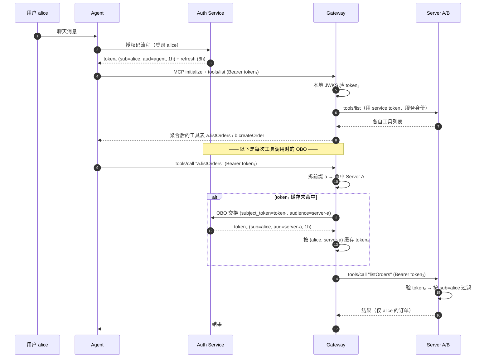

# MCP Gateway 搭建知识库

本文详细记录我们如何从零搭建一个 MCP Gateway：整体思路、关键技术决策、OBO 认证的优势与流程、以及网关如何聚合下游能力（哪些被聚合、冲突如何解决）。

## 1. 背景与目标

**问题**：一个 Agent（如 opencode、GitHub Copilot）需要同时使用多个后端 MCP Server 的工具。如果 Agent 直连每个下游，会有几个痛点：

1. **认证重复**：Agent 要对每个下游分别认证，且每个下游各自实现一遍认证逻辑。
2. **数据权限缺失**：下游不知道「当前是哪个用户在操作」，无法做按用户的数据过滤（行级权限）。
3. **入口分散**：Agent 要维护 N 个连接、N 份凭证。

**目标**：引入一个 **Gateway**，让 Agent 只连一个入口，Gateway 负责：

- **认证**（AuthN）：验证 Agent 的令牌。
- **聚合**（Aggregation）：把下游多个 MCP Server 的工具合并成一张表。
- **路由**（Routing）：把 Agent 的工具调用转发到正确的下游。
- **身份贯穿**：把「终端用户」的身份一路带到下游，让下游能按用户做数据权限过滤。

## 2. 整体架构

```
用户 alice ──聊天──▶ Agent (opencode / Copilot, MCP Client)
                        │  ① MCP + Bearer token₁（sub=alice）
   授权码流程登录          ▼
┌──────────────────┐  ┌──────────────────────────────┐
│ Auth Service(AS) │  │          Gateway             │
│  ·发访问/刷新令牌  │◄─│ 北向=MCP Server（认证+聚合+路由）│
│  ·OBO 令牌交换    │  │ 南向=MCP Client（连下游）        │
└────────┬─────────┘  └───────┬──────────────┬───────┘
    ② OBO 换 token₂ ──────────┘              │ ③ tools/call + token₂（sub=alice, aud=server-x）
                                 ┌──────────▼──────┐  ┌────────▼───────┐
                                 │  Server A        │  │  Server B        │
                                 │  listOrders      │  │  createOrder     │
                                 │ (按 sub 过滤数据) │  │ (order:create 校验)│
                                 └─────────────────┘  └─────────────────┘
```

**网关是「双面人」**：对外（北向）它扮演 MCP Server，对内（南向）它扮演 MCP Client。

```
Gateway = 北向 MCP Server（面对 Agent） + 南向 MCP Client（面对下游）
```

## 3. 关键技术决策与理由

| # | 决策 | 选择 | 理由 |
|---|---|---|---|
| D1 | 技术栈 | Java 17 + Spring Boot 4.1.1 + Spring AI 2.0.1 | 统一 Java/Spring 技术栈；Spring AI 同时提供 MCP Server 和 Client 的 Boot Starter |
| D2 | MCP 传输 | Streamable HTTP（单端点 `/mcp`） | MCP 现代标准（SSE 已废弃）；单端点利于在网关后统一做安全边界 |
| D3 | 授权服务器 | Spring Authorization Server 7.1.1（`spring-boot-starter-oauth2-authorization-server` 自动配置） | 官方项目、原生支持 RFC 8693 令牌交换；新版本通过 properties + 少量 Bean 即可完成客户端注册与端点配置 |
| D4 | 令牌格式 | JWT(JWS) + 本地 JWKS 验签 | 网关和下游本地验签，无需每次调用都回源 AS 做 introspection |
| D5 | 令牌 TTL | 访问令牌 1h，刷新令牌 8h | 平衡安全性与可用性 |
| D6 | 服务发现认证 | 启动时用 **client_credentials（服务身份）** 列工具，调用时用 **OBO（用户身份）** | 解决「列工具需要认证、但启动时还没有用户」的鸡生蛋问题 |
| D7 | 命名空间 | `<server-id>.<tool>`（如 `a.listOrders`） | 天然唯一，避免不同下游工具重名冲突 |
| D8 | 下游注册 | 静态配置（application.yml 写死 A/B 的 URL + audience） | 演示场景只需固定两个下游，避免引入服务发现复杂度 |
| D9 | 聚合范围 | **只聚合 tools**（不聚合 resources / prompts） | 见第 5 节，核心用例是「工具调用路由」 |

## 4. OBO 认证详解

### 4.1 什么是 OBO

**OBO（On-Behalf-Of）= 中间层代替用户，向下游请求资源。**

我们用的是 **RFC 8693（OAuth 2.0 Token Exchange）** 的通用实现，而不是微软 Entra 专有的 `on_behalf_of` grant。核心一句：

> **`sub`（主体）从头到尾始终是「用户」，网关换令牌时只换 `aud`（目标受众），不换 `sub`。**

| 概念 | 值 |
|---|---|
| grant_type | `urn:ietf:params:oauth:grant-type:token-exchange` |
| 请求参数 | `subject_token`（用户访问令牌）+ `subject_token_type` + `audience`（目标下游） |
| 令牌 | JWT，claims：`sub` / `aud` / `iss` / `exp` / `scope` |

### 4.2 OBO 的优势

| 优势 | 说明 |
|---|---|
| **用户身份贯穿端到端** | 下游拿到的 token₂ 的 `sub` 仍是真实用户，可直接做行级数据过滤（如「只返回 alice 自己的订单」） |
| **网关是唯一信任边界** | Agent 只信网关，下游只信 AS 发的令牌；下游无需了解 Agent 的存在 |
| **最小权限（按受众裁剪）** | 每个下游拿到的是 `aud` 指向它自己的令牌，而不是一把「万能钥匙」 |
| **下游无感知、零改造** | 下游只需做标准的资源服务器 JWT 校验 + 读 `sub`/`scope`，不知道 OBO 的存在 |
| **可审计可追踪** | 每一跳都有独立令牌，但 `sub` 不变，整条链可追溯是「哪个用户在操作」 |

### 4.3 令牌模型

| 令牌 | aud | sub | TTL | 持有者 | 用途 |
|---|---|---|---|---|---|
| token₁（访问） | agent | alice | 1h | Agent | Agent → 网关 |
| refresh（刷新） | agent | alice | 8h | Agent | 静默续期，免重新登录 |
| token₂（OBO 换发） | server-a / server-b | alice | 1h | Gateway（缓存） | 网关 → 下游 |
| service（服务） | gateway | gateway | 1h | Gateway | 启动时列工具 |

### 4.4 OBO 完整流程



逐步说明（以 `a.listOrders` 为例）：

1. **用户登录**：用户 alice 通过授权码流程在 AS 登录，Agent 拿到 `token₁`（`sub=alice`, `aud=agent`）。
2. **Agent 连网关**：Agent 作为 MCP Client 连网关，`Authorization: Bearer token₁`。
3. **网关验签**：网关作为资源服务器，用 AS 的 JWKS 本地验 `token₁`，得到当前用户 `sub=alice`。
4. **OBO 换发**：路由到 Server A 前，网关把 `token₁` 作为 `subject_token`、`audience=server-a` 发给 AS 换发。
5. **AS 换发**：AS 验证 `token₁` 有效后，签发 `token₂`，**保留 `sub=alice`，把 `aud` 改成 `server-a`**（这是 SAS 7.x 默认不会做的，我们通过 `OAuth2TokenCustomizer` 显式把请求的 audience 写进 `aud` claim）。
6. **下游调用**：网关用 `token₂` 调 Server A 的 `listOrders`，Server A 验签后按 `sub=alice` 过滤数据。
7. **缓存**：网关按 `(user, downstream)` 缓存 `token₂`，1 小时内重复调用不再打 AS。

> **为什么下游能做数据过滤**：Server A 收到的 `token₂` 的 `sub=alice`，它的工具实现里读 `JwtSupport.currentSubject()` 得到 `"alice"`，然后 `SELECT ... WHERE owner='alice'` 只返回 alice 的数据。**下游做授权，网关只做认证+路由，职责清晰。**

## 5. 下游能力聚合机制

### 5.1 聚合范围：只聚合 tools

MCP 服务器可以暴露三类能力：**tools**（可调用工具）、**resources**（上下文数据）、**prompts**（提示模板）。

我们当前的网关 **只聚合 tools**：

| 能力 | 是否聚合 | 说明 |
|---|---|---|
| **tools** | ✅ 聚合 | 核心用例：Agent 工具调用需要路由 + 数据权限 |
| **resources** | ❌ 不聚合 | 当前不需要；下游资源不走网关 |
| **prompts** | ❌ 不聚合 | 当前不需要 |

**为什么只聚合 tools**：

1. 我们的目标是「Agent 的工具调用路由 + 按用户数据过滤」，这本质是 tools 的诉求。
2. resources（如文件、数据库快照）和 prompts（如对话模板）在当前场景没有下游路由需求，聚合它们只会增加无谓的复杂度。
3. 网关南向客户端目前只调用 `McpSyncClient.listTools()`，不调用 `listResources()` / `listPrompts()`。

**如何扩展**：若未来要聚合 resources/prompts，用完全相同的模式即可——启动时调用 `listResources()` / `listPrompts()`，用同样的 `<server-id>.<name>` 命名空间，构建对应的 `SyncResourceSpecification` / `SyncPromptSpecification` bean（Spring AI 2.0 的 `McpServerAutoConfiguration` 同样通过 `ObjectProvider<List<SyncResourceSpecification>>`、`ObjectProvider<List<SyncPromptSpecification>>` 自动注册）。

### 5.2 聚合时的认证方式（服务身份）

网关**聚合（列）**下游 tools 时，用的是**服务身份**（OAuth2 `client_credentials`），不是用户身份（OBO）。这与「调用」时的认证不同：

| 时机 | 认证方式 | 令牌 sub | 用途 |
|---|---|---|---|
| 聚合 tools（`tools/list`） | client_credentials（服务身份） | gateway | 启动 + 定时刷新 |
| 调用 tool（`tools/call`） | OBO 令牌交换（用户身份） | alice | Agent 每次调用 |

**为什么聚合要用服务身份**：聚合发生在启动 / 定时刷新时，此时还没有用户上下文（没有 `sub=alice` 的 token₁），是「列工具需要认证、但还没有用户」的鸡生蛋问题。所以网关用自己的 client 凭证（`gateway:gateway-secret`，Basic auth）向 AS 发 `grant_type=client_credentials`，换一个服务令牌，再用它调下游的 `initialize` + `tools/list`。

```
Gateway ──① client_credentials (Basic: gateway:gateway-secret)──▶ AS
Gateway ◀──② service token (sub=gateway, aud=gateway)───────────── AS
Gateway ──③ initialize + tools/list (Bearer: service token)─────▶ Server A/B
```

下游照样用 JWKS 本地验签（验签名 + 过期），服务令牌签名有效即通过；下游不区分「服务令牌 vs 用户令牌」，只按令牌的 `sub` 做数据过滤（列工具时无用户数据可过滤，不涉及）。

**一句话**：**列工具用「网关是谁」（服务身份），调工具用「替哪个用户」（OBO 用户身份）。**

### 5.3 冲突如何解决：命名空间

MCP 的 tools 名在同一服务器内必须唯一。当两个下游都有 `listOrders` 时，直接合并会冲突。

**方案：给每个工具加服务器前缀 `<server-id>.<tool>`。**

```
Server A: listOrders   ──▶  a.listOrders
Server B: createOrder  ──▶  b.createOrder

（若 A、B 都叫 echo）
Server A: echo  ──▶  a.echo
Server B: echo  ──▶  b.echo   ← 天然不冲突
```

**实现**：`mcp-common` 里的 `NamespacedTool` 负责这个前缀逻辑：

- `NamespacedTool.fullName(serverId, toolName)` → `"a.listOrders"`
- `NamespacedTool.fromFullName("a.listOrders")` → `(serverId="a", toolName="listOrders")`，按**第一个 `.`** 切分。

**路由时反向拆前缀**：网关收到 `tools/call "a.listOrders"` → 拆出前缀 `a` → 命中 Server A → 去掉前缀转发 `listOrders`。工具名本身若含 `.`（如 `foo.bar`），因为只在**第一个** `.` 处切分，`b.foo.bar` 会被正确拆成 `(b, "foo.bar")`。

> 对比：Spring AI 的 MCP Client 有一个默认的 `DefaultMcpToolNamePrefixGenerator`，它在冲突时会自动加 `alt_1_`、`alt_2_` 前缀。我们**不用它**，而是用显式的 `<server-id>.<name>`，因为前缀即路由键，语义更清晰、可预测。

### 5.4 聚合的实现细节（关键代码路径）

网关的聚合分两部分：**启动时初始聚合** + **定时刷新**（见 5.5）。初始聚合的流程如下：

```
① 拿 service token（client_credentials，网关自己的服务身份）
        │
② 对每个下游：new DownstreamConnection(id, audience, url, serviceToken)
        │     └─ 内部：McpClient.sync(HttpClientStreamableHttpTransport) + initialize()
        │            （请求定制器注入 Authorization 头）
③ 对每个下游：client.listTools(serviceToken)  → 拿到原始工具列表
        │
④ 对每个工具：加前缀 + 包一层路由 handler → 构造成 SyncToolSpecification
        │
⑤ 汇总成 List<SyncToolSpecification> 这个 Spring Bean
        │
        └─ Spring AI 的 McpServerAutoConfiguration 自动把它注册到北向 MCP Server
```

核心类是 `GatewayToolConfig.gatewayTools(...)`，它返回一个 `List<SyncToolSpecification>` Bean。每个 `SyncToolSpecification` 内部持有一个 `(exchange, request) -> CallToolResult` 的 handler，这个 handler 就是**路由 + OBO + 转发**的逻辑：

```java
(exchange, request) -> {
    String subject = JwtSupport.currentSubject();      // 从北向 token₁ 拿 sub=alice
    String token1   = JwtSupport.currentTokenValue();   // 拿 token₁ 原文
    String token2   = oboTokenClient.exchange(subject, token1, audience); // OBO 换发
    return connection.callTool(originalToolName, request.arguments(), token2); // 转发下游
}
```

**南向如何带令牌**：下游也要认证，所以网关作为 MCP Client 发起的每个 HTTP 请求都要带 `Authorization: Bearer <token>`。实现上，`HttpClientStreamableHttpTransport` 支持一个 `httpRequestCustomizer`，在每次发请求前注入令牌。令牌用一个 `AtomicReference<String>` 承载（**不能用 `ThreadLocal`**——MCP 客户端内部是 Reactor 异步，SSE 流会在别的线程上打开，ThreadLocal 线程隔离会导致丢令牌，这是实测踩过的坑）。

### 5.5 定时刷新（动态聚合）

下游可能「一开始不在线，后来才上线」或「上线了又挂掉」。为此网关不是只聚合一次，而是**周期性地重连下游、重新拉取工具表，并做 diff 更新**。

- **触发**：`ToolRefreshScheduler` 用 `@Scheduled` 周期执行（`gateway.refresh-interval-ms`，默认 30s，可配）。
- **流程**：
  1. 拿 service token（client_credentials）。
  2. 对每个下游：`refreshTools()` 重新（或首次）连接 + `listTools()`。
     - 连接采用**懒连接 + 失败自动重连**：`DownstreamConnection` 内部用 volatile 的 `McpSyncClient`，连接失败即 close 并置空，下个周期重连。
  3. 与当前已注册工具做 diff：
     - 下游下线 / 工具被删 → `McpSyncServer.removeTool(name)`；
     - 新下游上线 / 新工具出现 → `McpSyncServer.addTool(spec)`。
  4. 若有变化 → `McpSyncServer.notifyToolsListChanged()`，向已连接的 Agent 推送 `tools/listChanged` 通知（网关已声明 `tools.listChanged=true` 能力）。

- **实测行为**：Server B 下线后，网关下一周期自动移除 `b.createOrder`；Server B 重启后，网关自动加回 `b.createOrder` 并通知客户端。

> 注意：下游「离线」期间，对应工具已从网关移除，Agent 不会再看到/调用它；下游恢复后，工具自动回归。整个过程无需重启网关。

### 5.6 实现要点与坑

- **懒连接**：`DownstreamConnection` 不再在构造时强制连接，构造只记录配置；首次 `refreshTools()` 才真正 `initialize()`，避免「下游没起来导致网关启动失败」。
- **令牌注入不能用 ThreadLocal**：MCP 客户端内部是 Reactor 异步，SSE 流会在别的线程打开，ThreadLocal 线程隔离会丢令牌 → 用 `AtomicReference`。
- **多 `List<SyncToolSpecification>` bean 冲突**：Spring AI 的注解扫描也会产生同类型 bean，注入时需 `@Qualifier("gatewayTools")` 指定自己的那份。

## 6. 网关内部组件

| 组件 | 职责 |
|---|---|
| `GatewayProperties` | 读取 `gateway.*` 配置（token 端点、client 凭证、下游 URL + audience、刷新间隔） |
| `OboTokenClient` | 调 AS 做 OBO 换发 + client_credentials；含按 `(user, audience)` 的 token 缓存 |
| `DownstreamConnection` | 封装一个下游的 MCP Client；懒连接 + 失败重连 + 令牌注入 |
| `GatewayToolManager` | 聚合工具 + 构建 `SyncToolSpecification` + 路由/OBO 逻辑 |
| `GatewayToolConfig` | 装配 Bean（obo client / connections / 初始工具表） |
| `ToolRefreshScheduler` | `@Scheduled` 周期刷新工具表 + diff + 通知客户端 |
| `SecurityConfig` | 网关自身作为资源服务器，验北向 token₁（JWT + JWKS） |

## 7. 运行与验证

### 7.1 启动（4 个服务）

| 服务 | 端口 | 模块 |
|---|---|---|
| Auth Service | 9000 | `mcp-auth-server` |
| Server A | 9001 | `mcp-example-server-a` |
| Server B | 9002 | `mcp-example-server-b` |
| Gateway | 8080 | `mcp-gateway` |

### 7.2 验证结果（实测）

```
1. 授权码登录 alice ──▶ token₁ (sub=alice)
2. 网关 initialize ──▶ serverInfo.name = "gateway"
3. 网关 tools/list ──▶ [a.listOrders, b.createOrder]      ← 聚合成功
4. tools/call a.listOrders ──▶ ["order-101","order-102"]   ← alice 的订单
5. tools/call b.createOrder ──▶ "order-1 created for alice" ← 权限校验通过
```

第 4、5 步证明：**用户身份（sub=alice）经 OBO 贯穿到下游，下游据此做了数据过滤和权限校验。**

### 7.3 用 opencode / Copilot 接入

网关是标准 MCP Server（`http://localhost:8080/mcp`），唯一要求是带一个有效的 `token₁`。项目提供了 `scripts/get-token.ps1` 一键获取令牌并打印可直接粘贴的配置片段。

## 8. 一个关键踩坑记录（供参考）

- **SAS 7.x 默认不把 audience 写进 token 的 `aud`**：`JwtGenerator` 默认把 `aud` 设为「请求令牌的客户端 id」（即网关自己的 id）。要让下游收到的 token₂ 的 `aud=server-a`，必须加一个 `OAuth2TokenCustomizer<JwtEncodingContext>`，在 grant 为 `token-exchange` 时把请求里的 `audience` 显式写进 `aud` claim。
- **下游所有请求都要认证**（包括 `initialize` 和 `tools/list`），导致「列工具需要认证、启动时还没有用户」——用服务身份（client_credentials）列工具、用户身份（OBO）调工具解决。
- **令牌注入不能用 ThreadLocal**（Reactor 异步线程隔离），要用 `AtomicReference`。
- **Boot 4 自定义 SecurityFilterChain 时不会自动创建 JwtDecoder**，需显式声明 `NimbusJwtDecoder.withJwkSetUri(...)` bean。

